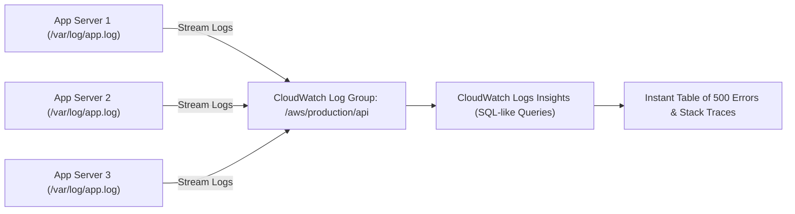

# Amazon CloudWatch — Beginner to CloudOps Pro Guide

---

## 1. Technical Definition: Amazon CloudWatch

> **Formal Technical Definition:**
> **Amazon CloudWatch** is an integrated observability and management telemetry platform designed for DevOps engineers, developers, and cloud operations teams. It collects, correlates, and monitors raw performance telemetry across three core data dimensions: **Metrics** (time-series numeric data), **Logs** (unstructured and structured textual event records), and **Events/Traces** (system state change notifications). CloudWatch evaluates incoming telemetry against user-defined threshold alarms, visualizes multi-resource health via unified dashboards, and automatically triggers automated incident remediation workflows via Amazon SNS, Auto Scaling, Systems Manager, and AWS EventBridge.

### 1.1 The Conceptual Analogy (For Intuition)

*   **The Aircraft Cockpit & Black Box**: Flying AWS infrastructure without CloudWatch is like flying a jet blindfolded. CloudWatch acts as the cockpit flight panel (live gauges plotting engine speed, altitude, and fuel) and the flight data black box (recording every log and pilot communication for post-incident investigation).

```
+---------------------------------------------------------------------------------------------------+
|                                     AMAZON CLOUDWATCH ECOSYSTEM                                   |
|                                                                                                   |
|  +--------------------+     +--------------------+     +-------------------+                      |
|  |     1. METRICS     |     |      2. LOGS       |     |     3. ALARMS     |                      |
|  | (Numbers & Graphs) |     |  (Text & Events)   |     | (Threshold Watch) |                      |
|  | - CPU %            |     | - App error logs   |     | - CPU > 80%       |                      |
|  | - Memory % (Agent) |     | - Access logs      |     | - Disk Space > 90%|                      |
|  | - Disk Space Free  |     | - System logs      |     | - 5XX Errors > 10 |                      |
|  +---------+----------+     +---------+----------+     +---------+---------+                      |
|            |                          |                          |                                |
|            v                          v                          v                                |
|  +---------------------------------------------------------------------------------------------+  |
|  |                                  CLOUDWATCH ACTIONS & ROUTING                               |  |
|  |                                                                                             |  |
|  |   [ 📊 Dashboards ]         [ 🔍 Logs Insights ]        [ 🚨 Amazon SNS (PagerDuty/Email) ] |  |
|  |   Visual Graphs for         Run SQL-like queries        Alerts the On-Call Engineer at 2 AM |  |
|  |   the Operations Center     to find root causes                                             |  |
|  |                                                                                             |  |
|  |   [ ⚙️ EC2 Auto-Recovery ]   [ 📈 Auto Scaling ]        [ ⚡ EventBridge Automations ]       |  |
|  |   Reboots dead instances    Adds more servers on spike  Triggers Lambda remediation scripts |  |
|  +---------------------------------------------------------------------------------------------+  |
+---------------------------------------------------------------------------------------------------+
```

---

## 2. The Five Core Pillars of CloudWatch

| Pillar | Technical Definition | Conceptual Role | Real-World Operational Metric |
| :--- | :--- | :--- | :--- |
| **1. Metrics** | Variable time-series numeric data points identified by a Namespace, Metric Name, and 1 or more Dimensions. | Gauges on a dashboard. | EC2 `CPUUtilization`, EBS `VolumeQueueLength`, RDS `FreeableMemory`. |
| **2. Logs** | Centralized, timestamped text streams organized into Log Streams and Log Groups. | Application and system black box. | Web access logs, application runtime stack traces, `/var/log/messages`. |
| **3. Alarms** | Stateful watchers evaluating metric data points over evaluation periods against defined statistical thresholds. | Warning siren / Pager alert. | Page on-call if HTTP 500 error count $> 10 \text{ in 1 minute}$. |
| **4. Dashboards** | Customizable visual grid pages rendering metric widgets, alarm statuses, and log query results. | Central operations wall screen. | Single-pane-of-glass overview of Production infrastructure health. |
| **5. Events (EventBridge)** | Real-time event routing bus that captures AWS infrastructure state changes and routes them to targets. | Automated circuit breaker / trigger. | If EC2 instance state changes to `terminated`, trigger a Lambda notification. |

---

## 3. The "Hypervisor Metric Boundary": What AWS Can & Cannot See

### 3.1 Technical Root Cause: The Hypervisor Separation Model
*   The AWS EC2 hypervisor monitors the virtual machine externally at the physical hardware boundary.
*   **External (Out-of-the-box)**: The hypervisor natively measures CPU cycles consumed, network packets processed through the virtual ENI, disk block reads/writes, and hypervisor hardware health checks.
*   **Internal (The Hypervisor Blind Spot)**: The hypervisor **cannot inspect guest OS kernel memory structures** or the local filesystem table without violating guest security isolation boundaries. Therefore, **Memory (RAM) utilization, internal Disk Space free/used, and OS process tables are completely invisible to AWS by default**.

```
+-------------------------------------------------------------------------------+
|                      PHYSICAL EC2 HOST (THE HYPERVISOR)                       |
|                                                                               |
|   [ Visible to AWS Hypervisor Natively (FREE Default Metrics) ]               |
|   - CPU Utilization (%)                                                       |
|   - Network In / Out (Bytes & Packets)                                        |
|   - Disk Read / Write (EBS volume traffic)                                    |
|   - Status Checks (Hardware & Instance health)                                |
|                                                                               |
|   -------------------------------------------------------------------------   |
|   |                  GUEST OS KERNEL (Linux / Windows)                    |   |
|   |                                                                       |   |
|   |   HYPERVISOR BLIND SPOT (INVISIBLE TO AWS OUT-OF-THE-BOX!):           |   |
|   |   - RAM / Memory Usage (%) ❌                                          |   |
|   |   - Disk Space Used / Free inside /data (%) ❌                         |   |
|   |   - Swap Space Usage ❌                                                |   |
|   |   - Active OS Processes & Threads ❌                                   |   |
|   |                                                                       |   |
|   |   ===> SOLUTION: Install Amazon CloudWatch Unified Agent (CWAgent)! ✅  |   |
|   -------------------------------------------------------------------------   |
+-------------------------------------------------------------------------------+
```

---

## 4. Real-World Incident 1: The "10% CPU" Outage (The Memory Blind Spot)

### Technical Incident Description:
An e-commerce API service suffered a total crash.
1.  The on-call junior engineer inspected the AWS default CloudWatch dashboard: `CPUUtilization` showed **$10\%$**.
2.  Inside the guest Linux OS, a memory leak had consumed $99.9\%$ of available RAM.
3.  The Linux kernel invoked the **Out-Of-Memory (OOM) Killer**, executing `SIGKILL (-9)` on the main Java API application process.
4.  Because default CloudWatch lacked OS-level memory telemetry, the team wasted 45 minutes looking for network issues while the API was dead.

### The CloudOps Solution:
Deploy the **Amazon CloudWatch Unified Agent** (`amazon-cloudwatch-agent`) via user data or configuration management to publish `mem_used_percent` and `disk_used_percent` to the `CWAgent` custom namespace.

---

## 5. Hands-On: Installing the CloudWatch Agent on Linux

```bash
# 1. Download and install the official CloudWatch Agent package
sudo yum install -y amazon-cloudwatch-agent
# (On Ubuntu: sudo apt-get install -y amazon-cloudwatch-agent)

# 2. Configure metrics collection: /opt/aws/amazon-cloudwatch-agent/bin/config.json
sudo tee /opt/aws/amazon-cloudwatch-agent/bin/config.json << 'EOF'
{
  "agent": {
    "metrics_collection_interval": 60,
    "run_as_user": "root"
  },
  "metrics": {
    "namespace": "CWAgent",
    "metrics_collected": {
      "mem": {
        "measurement": [
          "mem_used_percent"
        ]
      },
      "disk": {
        "measurement": [
          "disk_used_percent"
        ],
        "resources": [
          "/"
        ]
      }
    }
  }
}
EOF

# 3. Start the CloudWatch Agent daemon
sudo /opt/aws/amazon-cloudwatch-agent/bin/amazon-cloudwatch-agent-ctl \
  -a fetch-config \
  -m ec2 \
  -c file:/opt/aws/amazon-cloudwatch-agent/bin/config.json \
  -s

# 4. Verify agent status is actively running
sudo /opt/aws/amazon-cloudwatch-agent/bin/amazon-cloudwatch-agent-ctl -a status
```

---

## 6. CloudWatch Logs Insights: Fast Incident Triage

> **Technical Definition:**
> **CloudWatch Logs Insights** is an interactive, distributed, purpose-built query engine for scanning and analyzing large volumes of log data stored in CloudWatch Log Groups using a specialized SQL-like pipeline query syntax.



### 5 Essential Logs Insights Queries Every CloudOps Engineer Must Know

#### Query 1: Extract the 25 Most Recent HTTP 500 Server Errors
```sql
fields @timestamp, @message, status, path
| filter status >= 500
| sort @timestamp desc
| limit 25
```

#### Query 2: Identify the Top 10 Slowest API Endpoints (Latency Isolation)
```sql
fields @timestamp, path, duration_ms
| filter duration_ms > 1000
| stats avg(duration_ms) as avg_duration, max(duration_ms) as max_duration by path
| sort max_duration desc
| limit 10
```

#### Query 3: Track Error Rate Spikes Over 5-Minute Time Buckets
```sql
filter @message like /(?i)(error|exception|fatal)/
| stats count(*) as error_count by bin(5m)
| sort @timestamp desc
```

#### Query 4: Identify Top Offending IP Addresses Triggering 403 Forbidden
```sql
fields @timestamp, client_ip, status
| filter status == 403
| stats count(*) as attempt_count by client_ip
| sort attempt_count desc
| limit 10
```

#### Query 5: Isolate Database Connection Pool Starvation & Timeouts
```sql
fields @timestamp, @message
| filter @message like /Connection timed out|Deadlock found|Too many connections/
| sort @timestamp desc
| limit 50
```

---

## 7. Real-World Incident 2: The $10,000 Log Retention Shock

### Technical Root Cause:
*   When a CloudWatch Log Group is created, its default retention setting is **`Never Expire`**.
*   A fleet of microservices ingesting 50 GB of verbose debug logs daily will accumulate 18 TB in a single year.
*   CloudWatch charges **\$0.03 per GB stored per month**. Retaining unneeded historical logs indefinitely results in compounding, unbounded monthly storage expenses.

### The CloudOps Best Practice:
*   Enforce standard **Retention Policies** in Terraform: **14 days** for non-production environments; **30 to 90 days** for production.
*   For regulatory retention (e.g. 7-year compliance), export logs to **Amazon S3 Glacier Flexible Deep Archive** at up to $90\%$ lower cost.

---

## 8. CloudWatch Alarms: Evaluation & Noise Suppression

### 8.1 Technical Anatomy of an Alarm
An alarm monitors a time-series metric and executes actions when the metric breaches a mathematical threshold across defined evaluation windows ($M \text{ out of } N \text{ datapoints}$).

```
       Metric: CPUUtilization (%)
       Threshold: >= 80%
       Period: 60 seconds (1 minute)
       Evaluation Periods: 3 out of 3 (Datapoints to Alarm)

  CPU %
  100% |                     [X]   [X]   [X] ====> ALARM STATE (Page On-Call via SNS)
   80% |----------------------|-----|-----|----------------- (Threshold Line)
   60% |         [X]          |     |     |
   40% |   [X]         [X]    |     |     |
       +----+-----+-----+-----+-----+-----+-----------------> Time (Minutes)
           Min 1 Min 2 Min 3 Min 4 Min 5 Min 6
```

### 8.2 The Missing Data Behavior (`treat_missing_data`)
*   `missing`: Sets alarm state to `INSUFFICIENT_DATA` when datapoints are absent.
*   `notBreaching`: Assumes missing datapoints are within healthy threshold bounds. **Mandatory for error-count metrics** (when zero errors occur, zero logs are sent).
*   `breaching`: Assumes missing datapoints indicate a failure state. **Mandatory for heartbeat and ping monitors**.

---

## 9. Beginner Summary Checklist for Amazon CloudWatch

- [x] **Install CloudWatch Agent** on all EC2 instances to monitor Memory and Disk space.
- [x] **Never leave Log Groups on `Never Expire`** — set 14, 30, or 90 days retention.
- [x] **Set `EvaluationPeriods = 3`** on alarms to prevent false alarms from brief 10-second traffic spikes.
- [x] **Set `treat_missing_data = "notBreaching"`** on error-rate alarms.
- [x] **Attach `ec2:recover` actions** on `StatusCheckFailed_System` alarms for automatic hardware self-healing.
