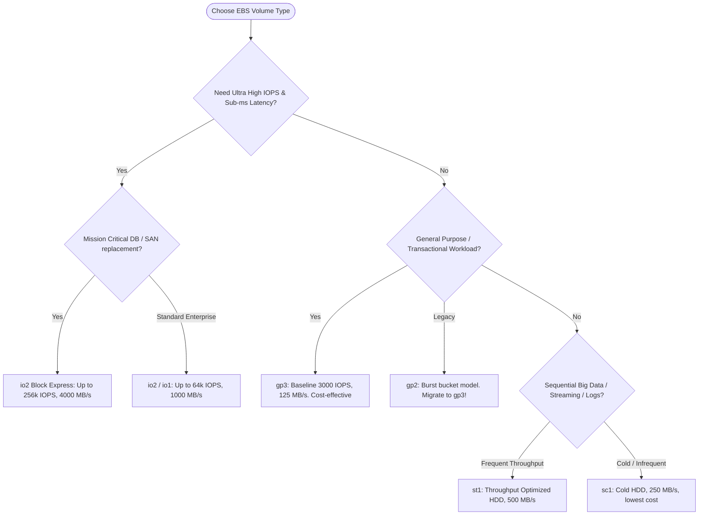

# AWS Elastic Block Store (EBS) — Beginner to CloudOps Pro Guide

---

## 1. Technical Definition: Amazon Elastic Block Store (EBS)

> **Formal Technical Definition:**
> **Amazon Elastic Block Store (EBS)** is a cloud-native, high-availability, raw block-level network-attached storage service designed specifically for Amazon EC2 instances. EBS volumes are provisioned as persistent, unformatted physical block devices communicated over a dedicated NVMe/PCIe storage fabric. Each EBS volume is automatically replicated across multiple physical storage servers within a single **Availability Zone (AZ)** to provide $99.8\% - 99.999\%$ availability and protect against hardware component failures. Point-in-time backups are captured as block-level delta snapshots stored durably in **Amazon S3** ($99.999999999\%$ durability).

### 1.1 The Conceptual Analogy (For Intuition)

*   **Instance Store (Ephemeral Cache)**: Like temporary data sitting in RAM or an unbacked local scratch disk inside a computer. If the instance is stopped or host hardware fails, **all data is permanently lost**.
*   **Amazon EBS (Persistent External Drive)**: Like a **high-speed external SSD** connected to your virtual server over a dedicated high-bandwidth fiber cable. If your virtual server crashes, freezes, or is terminated, you can instantly detach the EBS volume and attach it to a brand-new server; **all files, file systems, and databases remain 100% intact**.

```
+-----------------------------------------------------------------------------------------+
|                                    AWS REGION                                           |
|                                                                                         |
|   +---------------------------------------------------------------------------------+   |
|   |                       AVAILABILITY ZONE (e.g., us-east-1a)                      |   |
|   |                                                                                 |   |
|   |   +-----------------------+                    +----------------------------+   |   |
|   |   |      EC2 INSTANCE     |   Dedicated NVMe   |         EBS VOLUME         |   |   |
|   |   |   (The Virtual CPU/   |<==================>| (Virtual Hard Drive / SSD) |   |   |
|   |   |       Memory)         |   Fiber Network    |                            |   |   |
|   |   +-----------------------+                    | Automatically replicated   |   |   |
|   |                                                | across multiple servers in |   |   |
|   |                                                | AZ for 99.999% reliability |   |   |
|   |                                                +--------------+-------------+   |   |
|   +---------------------------------------------------------------|-----------------+   |
|                                                                   |                     |
|                                            Point-in-Time Snapshot | (Backup)            |
|                                                                   v                     |
|                                            +----------------------------------------+   |
|                                            |           AMAZON S3 STORAGE            |   |
|                                            |    11 Nines (99.999999999%) Durability |   |
|                                            +----------------------------------------+   |
+-----------------------------------------------------------------------------------------+
```

---

## 2. Storage Architecture Comparison

| Storage Type | AWS Service | Technical Access Protocol | Multi-Host Concurrency | Latency Profile | Primary CloudOps Use Case |
| :--- | :--- | :--- | :--- | :--- | :--- |
| **Block Storage** | **Amazon EBS** | NVMe / iSCSI block protocol | Single Instance (*Multi-Attach for cluster FS*) | Sub-millisecond to low single-digit ms | OS Boot Disks, Relational Databases (PostgreSQL, MySQL), ERPs, High-IOPS transactional workloads. |
| **File Storage** | **Amazon EFS** / **FSx** | NFSv4 (EFS) / SMB & Lustre (FSx) | Concurrent read/write from 1000s of instances | 2ms - 10ms | Shared web application state, CI/CD workspaces, home directories, media processing pipelines. |
| **Object Storage** | **Amazon S3** | REST API (HTTPS GET/PUT) | Distributed API access (no OS mount) | 50ms - 200ms (TTFB) | Static assets, log archives, data lakes, disaster recovery snapshots, backups. |
| **Ephemeral Block** | **Instance Store** | Direct attached host bus (PCIe) | Single host instance only | Microsecond (ultra-low) | Temporary scratch space, cache layers (Redis, Memcached), ephemeral buffer data. *(Data lost on stop/terminate!)* |

---

## 3. Performance Dynamics: IOPS vs Throughput

### 3.1 Technical Definitions

1.  **IOPS (Input/Output Operations Per Second)**:
    *   *Technical Definition*: The metric measuring the total count of distinct read and write operations an EBS volume can process per second. Standard EBS benchmarking measures IOPS using standard $16 \text{ KiB}$ or $256 \text{ KiB}$ block sizes.
    *   *CloudOps Impact*: Relational databases (e.g., executing thousands of small `SELECT` or `UPDATE` queries) are primarily **IOPS-bound**.
2.  **Throughput (MegaBytes per Second - MB/s)**:
    *   *Technical Definition*: The metric measuring the total volume of raw data successfully transferred between the EC2 host and the EBS storage cluster per second.
    *   *Formula*: $$\text{Throughput (MB/s)} = \frac{\text{IOPS} \times \text{I/O Block Size (KB)}}{1024}$$
    *   *CloudOps Impact*: Log collectors, streaming pipelines, and ETL jobs (e.g., reading a continuous 10 GB file) are primarily **Throughput-bound**.

### 3.2 Conceptual Analogy: The Courier & Highway Cargo

```
        IOPS (Input/Output Operations Per Second):
        "How many small envelopes a delivery courier can hand over every second."
        [ 📦 ] [ 📦 ] [ 📦 ] [ 📦 ] [ 📦 ] ===> High transaction speed (Databases)

        THROUGHPUT (MegaBytes per Second - MB/s):
        "The total gross weight of cargo traveling down the highway at once."
        [ 🚚==================================🚚 ] ===> High volume streaming (Logs/Backups)
```

---

## 4. EBS Volume Types Matrix



### 4.1 Technical Specifications

| Volume Type | API Identifier | Underlying Media | Volume Size Range | Max IOPS / Volume | Max Throughput / Volume | Durability (AFR) | Ideal Use Case |
| :--- | :--- | :--- | :--- | :--- | :--- | :--- | :--- |
| **General Purpose SSD** | `gp3` | Solid State (SSD) | 1 GiB - 16 TiB | 16,000 IOPS | 1,000 MB/s | 99.8% - 99.9% | Default choice for OS disks, dev/stage, virtual desktops, medium databases. |
| **General Purpose SSD (Legacy)** | `gp2` | Solid State (SSD) | 1 GiB - 16 TiB | 16,000 IOPS | 250 MB/s | 99.8% - 99.9% | Legacy workloads with 3 IOPS/GiB credit bucket. *Action: Migrate to gp3*. |
| **Provisioned IOPS SSD** | `io2` | Solid State (SSD) | 4 GiB - 16 TiB | 64,000 IOPS | 1,000 MB/s | 99.999% (5 nines) | High-transaction databases (Oracle, MS SQL, SAP HANA, PostgreSQL). |
| **Provisioned IOPS Block Express** | `io2` (Nitro Gen 5/6/7) | SRA architecture SSD | 4 GiB - 64 TiB | 256,000 IOPS | 4,000 MB/s | 99.999% | Enterprise SAN replacement in cloud. Sub-millisecond latency. |
| **Throughput Optimized HDD** | `st1` | Magnetic HDD | 125 GiB - 16 TiB | 500 IOPS | 500 MB/s | 99.8% - 99.9% | Big Data clusters (Hadoop/EMR), Kafka log directories, ETL pipelines. |
| **Cold HDD** | `sc1` | Magnetic HDD | 125 GiB - 16 TiB | 250 IOPS | 250 MB/s | 99.8% - 99.9% | Cold logging, low-access file archives. *(Non-bootable)* |

---

## 5. Real-World Incident 1: The "3 AM Black Friday" Crash (The `gp2` Burst Bucket Trap)

### Technical Root Cause:
*   On legacy `gp2` volumes, baseline performance is strictly tied to disk capacity: **$3 \text{ IOPS per GiB}$**.
*   A $100 \text{ GiB}$ disk has a baseline of only $300 \text{ IOPS}$. AWS allocates an initial burst credit bucket of $3,000 \text{ IOPS}$.
*   During sustained heavy traffic, I/O consumption exceeds credit replenishment. Once the credit bucket reaches $0\%$, AWS throttles disk performance down to $300 \text{ IOPS}$, causing severe I/O queue buildup, database connection timeouts, and application crashes.

```
gp2 Burst Bucket Balance over time:
100% |========================\
 75% |                         \
 50% |                          \ (Sustained I/O drains credit bucket)
 25% |                           \
  0% |----------------------------\______________________ (THROTTLED TO 300 IOPS! Production Outage)
     +---------------------------------------------------> Time (Hours)
```

### The CloudOps Remediation:
Migrate from `gp2` to **`gp3`** using AWS Elastic Volumes (zero downtime). `gp3` provides an un-throttled **3,000 IOPS baseline guaranteed**, regardless of volume size, while costing **20% less per GiB**.

---

## 6. EBS Snapshots & Data Lifecycle Manager (DLM)

### 6.1 Technical Definition: Incremental Block Tracking
> **Technical Definition:**
> An **EBS Snapshot** is a point-in-time, crash-consistent, block-level incremental backup of an EBS volume stored in Amazon S3. Only storage blocks that have changed since the preceding snapshot are transferred and written to S3, referencing unchanged blocks from earlier snapshots to optimize storage efficiency.

```
Day 1 (Initial Snapshot):
Disk Blocks:    [ Block A ]  [ Block B ]  [ Block C ]  [ Block D ]
Snapshot 1:     [ Block A ]  [ Block B ]  [ Block C ]  [ Block D ]  ===> Stored in S3

Day 2 (Delta Modification):
Disk Blocks:    [ Block A ]  [ Block B*]  [ Block C ]  [ Block D*]
Snapshot 2:                  [ Block B*]               [ Block D*]  ===> Only Delta Blocks written to S3!
```

---

## 7. CloudOps Linux Runbook: Volume Provisioning, Mounting & Live Expansion

### Scenario A: Initializing and Mounting a New 100GB Data Disk

```bash
# 1. Identify connected block devices and NVMe topology
lsblk

# Expected output:
# NAME         MAJ:MIN RM  SIZE RO TYPE MOUNTPOINTS
# nvme0n1      259:0    0   30G  0 disk 
# ├─nvme0n1p1  259:1    0   30G  0 part /        <-- OS boot disk
# nvme1n1      259:2    0  100G  0 disk          <-- Unformatted secondary volume

# 2. Check if a filesystem header already exists (CRITICAL check to avoid data loss)
sudo file -s /dev/nvme1n1
# Output "/dev/nvme1n1: data" indicates an unformatted raw volume.

# 3. Format the volume with the XFS filesystem
sudo mkfs -t xfs /dev/nvme1n1

# 4. Create the target mount directory and mount
sudo mkdir -p /data
sudo mount /dev/nvme1n1 /data

# 5. Retrieve the volume UUID for persistent /etc/fstab configuration
sudo blkid /dev/nvme1n1
# Example Output: /dev/nvme1n1: UUID="9a7c3b21-4def-4321-abcd-123456789abc" TYPE="xfs"

# 6. Configure /etc/fstab safely (ALWAYS include the 'nofail' flag to prevent boot lockouts)
echo "UUID=9a7c3b21-4def-4321-abcd-123456789abc  /data  xfs  defaults,nofail  0  2" | sudo tee -a /etc/fstab

# 7. Test fstab entries without rebooting
sudo umount /data
sudo mount -a
df -hT /data
```

---

### Real-World Incident 2: The Server That Wouldn't Reboot (The `/etc/fstab` Trap)

#### Technical Root Cause:
During system initialization, `systemd` parses `/etc/fstab`. If a listed block device is missing (e.g. detached EBS volume) and lacks the **`nofail`** mount option, `systemd` treats the missing block device as a critical dependency failure, aborts the multi-user boot target, and locks the server in **Emergency Maintenance Mode**.

```bash
# INCORRECT (Halts server on missing volume):
UUID=9a7c3b21-4def-4321-abcd-123456789abc  /data  xfs  defaults  0  2

# CORRECT (Allows server to boot normally if volume is detached):
UUID=9a7c3b21-4def-4321-abcd-123456789abc  /data  xfs  defaults,nofail  0  2
```

---

### Scenario B: Online Live Volume Expansion (Zero Downtime)

```bash
# 1. Modify volume capacity via AWS CLI (e.g. expand to 200 GiB)
aws ec2 modify-volume --volume-id vol-0123456789abcdef0 --size 200

# 2. Check updated raw block device size recognized by OS kernel
lsblk

# 3. If disk contains a partition table (e.g. nvme1n1p1), extend the partition:
sudo growpart /dev/nvme1n1 1

# 4. Expand the filesystem to claim the expanded block capacity:
# For XFS:
sudo xfs_growfs -d /data

# For EXT4:
# sudo resize2fs /dev/nvme1n1p1

# 5. Verify the expanded capacity
df -h /data
```

---

## 8. CloudWatch EBS Metrics Reference

| CloudWatch Metric | Unit | CloudOps Operational Interpretation |
| :--- | :--- | :--- |
| `VolumeQueueLength` | Count | Number of pending read/write requests. High queue length with high latency indicates IOPS/Throughput starvation. |
| `BurstBalance` (gp2) | Percentage | Percentage of burst credit remaining. If $\le 20\%$, disk is in imminent danger of throttling. |
| `VolumeThroughputPercentage` | Percentage | % of provisioned throughput consumed (`gp3`, `io1`, `io2`). |
| `VolumeIOPSPercentage` | Percentage | % of provisioned IOPS consumed (`gp3`, `io1`, `io2`). |

---

## 9. Beginner Summary Checklist for AWS EBS

- [x] **Default to `gp3`** for all new general-purpose and boot workloads.
- [x] **Enforce Account-Wide Encryption** by default with AWS KMS.
- [x] **Always append `nofail`** to non-root `/etc/fstab` volume mounts.
- [x] **Observe the 6-hour modification cooldown** when executing volume resizes.
- [x] **Automate snapshot backups** with AWS Data Lifecycle Manager (DLM) tags.
