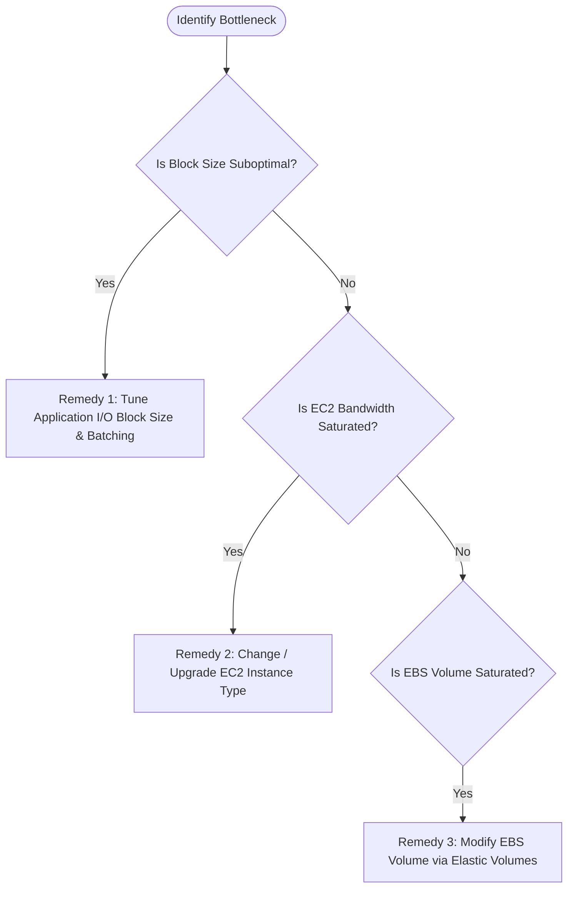
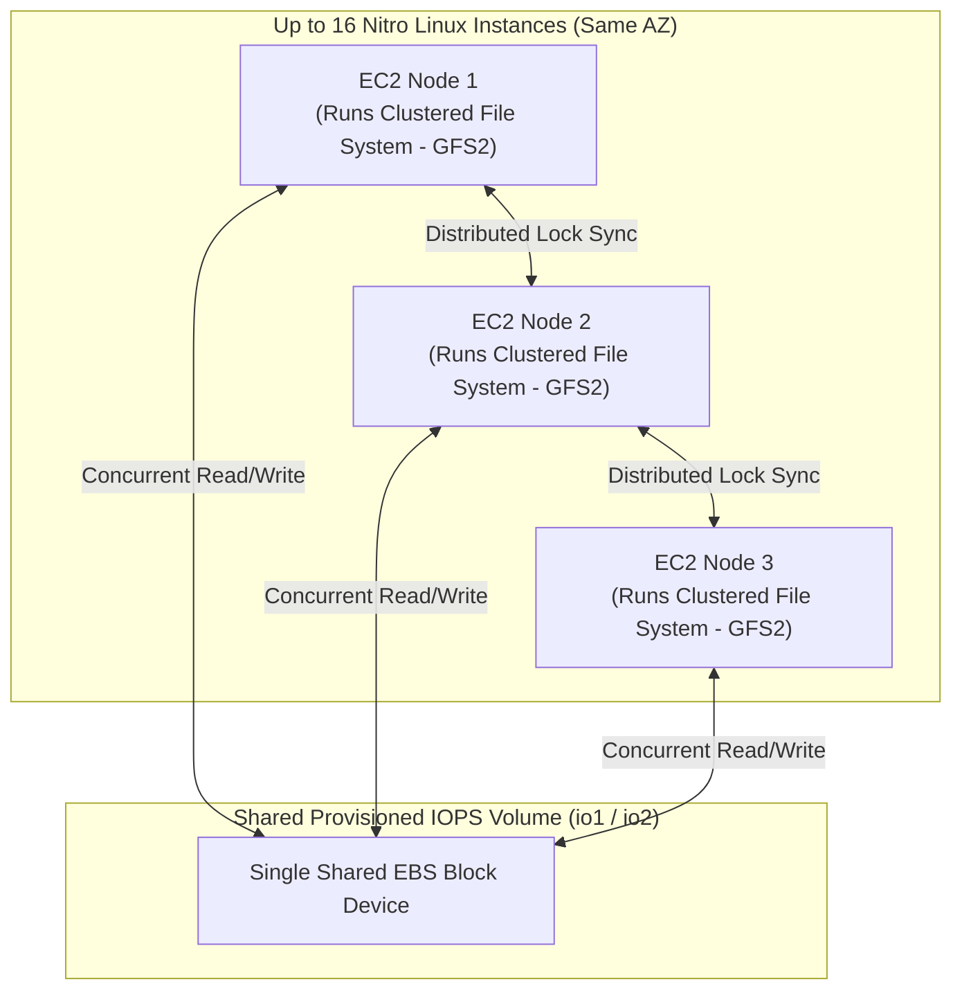

# AWS EBS: Performance Benchmarking, Optimization & Troubleshooting Guide

> **Official AWS Skill Builder Summary:**
> Comprehensive, high-yield guide covering EBS performance baselining, proactive CloudWatch alarms, the 4 troubleshooting categories, EC2 vs Volume right-sizing, volume attachment/detachment rules, Elastic Volume constraints (MBR vs GPT), and Amazon EBS Multi-Attach architecture.

---

## 1. Establishing Performance Baselines (Benchmarking)

> **Formal Technical Definition:**
> **Benchmarking** is the empirical measurement of storage subsystem performance (IOPS, throughput, latency, queue depth) under synthetic, simulated workloads. It establishes an empirical baseline to validate that provisioned storage meets application Service Level Objectives (SLOs).

### 1.1 The Golden Rule of Benchmarking
> [!CAUTION]
> **Never run benchmark tests on production volumes!**
> Synthetic I/O benchmarking saturates disk controllers and direct-write tests (`--direct=1`) will overwrite and **permanently destroy existing production data**. Always use dedicated, disposable non-production volumes.

### 1.2 7-Step Linux Benchmarking Workflow
```
[ 1. Launch EBS-Optimized EC2 ] ---> [ 2. Create Target EBS Volume ] ---> [ 3. Attach Volume ]
                                                                                   |
[ 7. Terminate & Cleanup ] <--- [ 6. Run Benchmark ] <--- [ 5. Install fio ] <--- [ 4. Mount Block Device ]
```

1.  **Launch** an EBS-optimized EC2 instance.
2.  **Create** a dedicated non-production EBS volume matching production specs (`gp3` or `io2`).
3.  **Attach** the volume to the instance.
4.  **Configure and mount** the block device (or test raw unmounted device).
5.  **Install benchmarking tools**:
    *   *Linux*: **`fio`** (Flexible I/O Tester) or Oracle Orion calibration tool.
    *   *Windows*: **`DiskSpd`** or **`CrystalDiskMark`**.
6.  **Execute benchmark** across the application's operating range ($4\text{ KiB} - 256\text{ KiB}$ block sizes).
7.  **Delete test volumes and terminate instance** to prevent ongoing AWS billing.

```bash
# Example fio command for synthetic random read/write testing on Linux
sudo fio --name=ebs_benchmark --filename=/dev/nvme1n1 --rw=randrw --rwmixread=70 \
  --bs=16k --iodepth=32 --direct=1 --runtime=60 --time_based --group_reporting
```

---

## 2. Proactive Monitoring & Key CloudWatch Alarms

Instead of reacting to user outages, set CloudWatch Alarms on key metric thresholds:

| Metric | Level | Unit | Operational Meaning & Alert Threshold |
| :--- | :--- | :--- | :--- |
| `VolumeQueueLength` | Volume | Count | Pending I/O requests. **Alarm if $> 5 - 10$ for 3 min**. |
| `VolumeIOPSExceededCheck` | Volume | 0/1 | Set to 1 if app attempts to drive IOPS beyond provisioned limit. |
| `VolumeThroughputExceededCheck`| Volume | 0/1 | Set to 1 if app attempts to drive MB/s beyond provisioned limit. |
| `VolumeAvgReadLatency` / `WriteLatency` | Volume | Seconds | Average operation completion time. **Alarm if $> 0.02\text{s}$ ($20\text{ms}$)**. |
| `BurstBalance` | Volume | % | Remaining burst bucket on `gp2`, `st1`, `sc1`. **Alarm if $< 20\%$**. |
| `EBSIOBalance%` | EC2 | % | Nitro instance-level IOPS credit bucket. **Alarm if $< 20\%$**. |
| `EBSByteBalance%` | EC2 | % | Nitro instance-level throughput credit bucket. **Alarm if $< 20\%$**. |

### 2.1 Retrieving EBS Metrics via AWS CLI
```bash
aws cloudwatch get-metrics-statistics \
  --namespace AWS/EBS \
  --metric-name VolumeReadBytes \
  --dimensions Name=VolumeId,Value=vol-0123456789abcdef0 \
  --start-time 2026-08-22T00:00:00Z \
  --end-time 2026-08-22T01:00:00Z \
  --period 300 \
  --statistics Sum
```

---

## 3. The 4 Core Troubleshooting Categories

Most Amazon EBS performance degradation falls into one of four distinct categories:

```
+---------------------------------------------------------------------------------------------------+
|                            THE 4 EBS TROUBLESHOOTING CATEGORIES                                   |
|                                                                                                   |
|  [ 1. IOPS Limit vs Block Size ]          [ 2. Throughput Saturated ]                             |
|  - Small blocks hit IOPS cap first.       - Large sequential streams hit MB/s cap.                |
|  - Metrics: VolumeIOPSExceededCheck,      - Metrics: VolumeThroughputExceededCheck,               |
|    EBSIOBalance%, VolumeRead/WriteOps.      BurstBalance, VolumeRead/WriteBytes.                  |
|                                                                                                   |
|  [ 3. Instance vs Volume Mismatch ]       [ 4. Latency Spikes & Micro-bursts ]                    |
|  - EC2 instance caps storage bandwidth.   - Storage queue delay or S3 lazy loading.               |
|  - Combined volume IOPS > Instance Max.   - Metrics: VolumeAvgRead/WriteLatency,                  |
|  - Metrics: VolumeQueueLength, EC2 limits.  VolumeQueueLength, iostat %util.                        |
+---------------------------------------------------------------------------------------------------+
```

### 3.1 Category 1: IOPS Limit vs Block Size Trade-Off
*   **The Physics**: $\text{Throughput} = \text{IOPS} \times \text{Block Size}$.
*   **The Problem**: If an app issues small $4\text{ KiB}$ blocks, a $3,000\text{ IOPS}$ limit caps throughput at only $12\text{ MB/s}$ ($3000 \times 4\text{ KiB}$).
*   **The Metric Math**:
    $$\text{Average IOPS (Ops/s)} = \frac{\text{Sum}(\text{VolumeReadOps}) + \text{Sum}(\text{VolumeWriteOps})}{\text{Period (seconds)}}$$
*   **The Fix**: Optimize application batching to write larger blocks ($16 - 64\text{ KiB}$), or scale provisioned IOPS on `gp3`/`io2`.

### 3.2 Category 2: Throughput Limits
*   **The Problem**: Workload demands more data per second than provisioned (e.g. streaming backups).
*   **The Metric Math**:
    $$\text{Average Throughput (Bytes/s)} = \frac{\text{Sum}(\text{VolumeReadBytes}) + \text{Sum}(\text{VolumeWriteBytes})}{\text{Period (seconds)}}$$
*   **The Fix**: Scale provisioned throughput up to $1,000\text{ MB/s}$ on `gp3`, or migrate from `sc1` to `st1`/`gp3`.

### 3.3 Category 3: EC2 Instance vs EBS Volume Mismatch
*   **The Golden Rule**: An EC2 instance must have bandwidth capacity equal to or greater than the combined performance of all attached EBS volumes.
*   **The Formula (Aggregate Nitro Metrics in `AWS/EC2` Namespace)**:
    $$\text{Avg Total IOPS} = \frac{\text{Sum}(\text{EBSReadOps}) + \text{Sum}(\text{EBSWriteOps})}{\text{Period (s)}}$$
    $$\text{Avg Total Throughput (Bps)} = \frac{\text{Sum}(\text{EBSReadBytes}) + \text{Sum}(\text{EBSWriteBytes})}{\text{Period (s)}}$$
*   **The Fix**: If aggregate IOPS/MB/s exceeds the instance limits, upgrade the EC2 instance size (e.g. `m5.large` $\rightarrow$ `m5.2xlarge`).

### 3.4 Category 4: Micro-Bursting Workloads
*   **The Problem**: Sub-second I/O bursts (e.g. 5,000 IOPS for 200ms) saturate disks, but 1-minute CloudWatch averages smooth out the spikes.
*   **The Indicator**: High `VolumeQueueLength` with normal CloudWatch latency and **non-zero `VolumeIdleTime`**.
*   **OS-Level Detection**:
    *   *Linux*: `iostat -xdmzt 1` (Check sub-second `%util` and `await`).
    *   *Windows*: `perfmon` (`PhysicalDisk\Avg. Disk sec/Transfer`).
*   **The Fix**: Increase provisioned IOPS/throughput on `gp3`/`io2`, or configure application I/O batching buffers.

---

## 4. The 3 Core Remediation Strategies



### Strategy A: Change / Upgrade the EC2 Instance Type
1.  **Compatibility Check**: Verify target instance CPU architecture (x86 vs ARM Graviton), virtualization type (HVM), and Enhanced Networking drivers (ENA).
2.  **Downtime Consideration**: Changing instance type requires stopping the instance.
3.  **Public IP Preservation**: The public IPv4 address will change unless an **Elastic IP (EIP)** is attached.
4.  **Precaution**: **Take an AMI snapshot** before changing instance types.

---

### Strategy B: Modifying EBS Volumes (Elastic Volumes)
*   **In-Place Modification**: Supported on all current-generation instances. Modify size, IOPS, throughput, and volume type without stopping the instance.
*   **The 6-Hour Cooldown**: After a modification, AWS enforces a **6-hour rate limit** while the volume is in the `optimizing` state.
*   **Emergency 6-Hour Bypass**: Snapshot the volume $\rightarrow$ Restore a new volume with target specs $\rightarrow$ Swap attachments.

---

### Strategy C: Partition Table Constraints (MBR vs GPT 2 TiB Limit)

> [!WARNING]
> **The 2 TiB (2,048 GiB) MBR Partition Barrier:**
> *   **Master Boot Record (MBR)**: Partition tables initialized as MBR **cannot address storage beyond 2 TiB**.
> *   *Windows*: If an MBR disk is expanded beyond 2 TiB in AWS, Windows **disables the Extend Volume option** in Disk Management.
> *   *Linux*: Boot volumes $\ge 2\text{ TiB}$ require **GUID Partition Table (GPT)** and **GRUB 2**.
> *   *CloudOps Solution*: For volumes $\ge 2\text{ TiB}$, always initialize the disk with a **GPT partition table**. If migrating an existing MBR volume, create a new GPT volume and copy files over.

---

## 5. Troubleshooting Volume Attachment & Detachment Issues

```mermaid
flowchart TD
    Issue{Connectivity Issue} -->|Attachment Failure| Att[Check 1: Availability Zone Match?\nCheck 2: Device Name Collision /dev/xxx?\nCheck 3: Instance State running/stopped & Volume available?\nCheck 4: Max 28 Nitro volume limit reached?\nCheck 5: Marketplace Product Code Subscribed?\nCheck 6: IAM / SCP AttachVolume permission denied?]
    Issue -->|Detachment Stuck| Det[Check 1: Root device? Stop instance first.\nCheck 2: Busy/mounted? Unmount & kill open handles (fuser -k -15).\nCheck 3: Force Detach as LAST RESORT -> Run fsck after.\nCheck 4: Run describe-volumes via AWS CLI.]
```

### 5.1 Attachment Issues: The 6 Root Causes & Remedies

| Root Cause | Specific Error / Symptom | CloudOps Diagnostic & Resolution |
| :--- | :--- | :--- |
| **1. Availability Zone (AZ) Mismatch** | Volume not visible or fails to attach to instance. | **EBS volumes are strictly AZ-bound**. Volume and EC2 instance must reside in the exact same AZ. If not: **Take a snapshot $\rightarrow$ Create a new volume in the instance's target AZ**. |
| **2. Device Name Collision** | `Invalid value '/dev/xxx' for unixDevice. Attachment point /dev/xxx is already in use.` | The specified mount point is already assigned. **Fix**: Choose an unused device name (e.g. `/dev/sdf` through `/dev/sdp`). |
| **3. Invalid State** | Attachment rejected by AWS API. | • **Instance**: Must be in `running` or `stopped` state (cannot attach during `starting` or `stopping`).<br>• **Volume**: Must be in `available` state. |
| **4. Max Volume Limit Reached** | Attachment fails silently with no error. | Each instance has an attachment limit (e.g., **up to 28 block devices on AWS Nitro instances**). Detach unused volumes. |
| **5. Marketplace Product Code** | Attachment blocked on custom AMI volume. | Ensure account is **subscribed to the Marketplace product code** and the EC2 instance satisfies code sizing/licensing requirements. |
| **6. IAM / SCP Authorization Denied** | `You are not authorized to perform this operation. Encoded authorization failure message: [...]` | Lacks `ec2:AttachVolume` permission or an AWS Organizations **SCP** is blocking it. Decode error via `aws sts decode-authorization-message` and update IAM/SCP policy. |

---

### 5.2 Detachment Issues: The 4 Rules & Remedies

1. **Volume Stuck in `busy` / `detaching` State**:
   * *Cause*: Active OS processes or open file descriptors are locking the mount.
   * *Resolution*: Kill open handles and unmount cleanly before requesting AWS detachment:
     ```bash
     # 1. Identify and terminate locking processes
     sudo lsof +D /data
     sudo fuser -vm /data

     # 2. Terminate locking processes gracefully
     sudo fuser -k -15 -m /data

     # 3. Unmount cleanly
     sudo umount /data
     ```
2. **Root Device Detachment Rule**:
   * If the volume is the **root boot volume** (`/dev/sda1` or `/dev/xvda`), you **must stop the EC2 instance** before detaching.
3. **Force Detachment (Last Resort)**:
   * *When to Use*: Only when the instance has crashed/frozen or the volume will be deleted.
   * *The Risk*: The OS does not flush in-memory caches or update filesystem metadata.
   * *Mandatory Post-Action*: **Must perform a filesystem repair** before remounting:
     ```bash
     sudo xfs_repair /dev/nvme1n1      # For XFS
     # sudo fsck.ext4 -f /dev/nvme1n1  # For EXT4
     ```
4. **AWS CLI Diagnostics**:
   ```bash
   aws ec2 describe-volumes --volume-ids vol-0123456789abcdef0
   ```

---

## 6. Troubleshooting Elastic Volume Modifications & Cooldown

When modifying an EBS volume (size, IOPS, throughput, volume type), the volume transitions through three states:
$$\text{modifying} \longrightarrow \text{optimizing} \longrightarrow \text{completed}$$

*   **Size changes take effect immediately** upon entering `modifying`.
*   **Performance** during `optimizing` is intermediate between source and target specifications.

```
+-----------------------------------------------------------------------------------+
|                        ELASTIC VOLUME MODIFICATION LIFECYCLE                      |
|                                                                                   |
|  [ modifying ] ===> Size expanded immediately!                                    |
|        |                                                                          |
|        v                                                                          |
|  [ optimizing ] ===> Storage blocks migrating. Cooldown timer running.            |
|        |             * Modify button is disabled in AWS Console.                  |
|        v                                                                          |
|  [ completed ] ===> Full target performance reached. Ready for next modification. |
+-----------------------------------------------------------------------------------+
```

### 6.1 The 6-Hour Rate Limit / Cooldown
*   **The Rule**: AWS enforces a **6-hour rate limit** after any volume modification before the same volume can be modified again.
*   **Emergency Bypass Procedure (If you cannot wait 6 hours)**:
    1. Take an EBS Snapshot of the volume in the `optimizing` state.
    2. Create a brand-new EBS volume from the snapshot with the targeted size/IOPS/throughput.
    3. Stop the instance $\rightarrow$ Detach original volume $\rightarrow$ Attach newly restored volume.
    4. *Note*: Pre-warm the restored volume to avoid lazy loading latency.

### 6.2 "The System is Unavailable" Error
*   **Cause**: AWS is performing backend host maintenance on the storage hardware. Volume performance and I/O remain unaffected, but modification APIs are temporarily blocked.
*   **Fix**: Check the **AWS Health Dashboard** for maintenance notifications. If urgent, create a new volume from a snapshot.

### 6.3 Post-Modification Filesystem Extension Runbook

#### Linux Instances:
```bash
# 1. Check updated physical disk size
lsblk

# 2. Extend partition table (if partition exists, e.g., partition 1)
sudo growpart /dev/nvme1n1 1

# 3. Extend the Filesystem:
# For XFS:
sudo xfs_growfs -d /data

# For EXT4:
sudo resize2fs /dev/nvme1n1p1
```

#### Windows Instances:
Open **Disk Management (`diskmgmt.msc`)** $\rightarrow$ Right-click volume $\rightarrow$ Select **Extend Volume**, or run in PowerShell:
```powershell
Resize-Partition -DriveLetter D -Size (Get-PartitionSupportedSize -DriveLetter D).SizeMax
```

---

## 7. Amazon EBS Multi-Attach Architecture

> **Formal Technical Definition:**
> **Amazon EBS Multi-Attach** allows a single Provisioned IOPS SSD (**`io1`** or **`io2`**) volume to be concurrently attached to up to **16 Linux EC2 instances** built on the AWS Nitro System within the **same Availability Zone**.



### 7.1 The 4 Primary Use Cases for Multi-Attach

| Use Case | Architecture Benefit | Operational Requirement |
| :--- | :--- | :--- |
| **1. Clustered Database Systems** | High availability and read/write load balancing across database nodes. | Requires database software designed for shared storage with distributed locking. |
| **2. Distributed Shared Applications** | Concurrent state access for microservices and data processing. | Application-level write synchronization or clustered filesystem. |
| **3. High-Speed Failover (Low RTO)** | Eliminates volume detachment/reattachment delays during node failover. | Active/Standby fencing (Pacemaker/Corosync) to prevent split-brain writes. |
| **4. Read-Heavy Computational Workloads** | Multiple worker instances read the same large dataset concurrently. | Shared pool of provisioned IOPS; ideal for read-only analytics/simulations. |

### 7.2 Critical Multi-Attach Rules & Constraints
1.  **Exclusively Provisioned IOPS**: Supported strictly on **`io1`** and **`io2`** volumes.
2.  **Same Availability Zone**: All attached instances must reside in the same AZ.
3.  **No Boot Volumes**: Multi-Attach volumes cannot be used as OS boot disks.
4.  **No AWS-Managed I/O Fencing**: AWS does not coordinate writes. **Standard file systems (`ext4`, `xfs`, `NTFS`) will cause immediate data corruption**. You **must** use a cluster-aware file system (e.g. **GFS2**, **OCFS2**).
5.  **Provisioned IOPS Sharing**: Total provisioned IOPS and throughput are shared collectively across all attached instances.

---

## 8. Linux CloudOps Diagnostic & Expansion Runbook

```bash
# 1. Real-time I/O saturation and queue inspection (Sampled every 1 second)
iostat -xdmzt 1

# 2. Check I/O Wait CPU percentage (wa > 20% indicates storage bottleneck)
vmstat 1

# 3. Map NVMe block device name to AWS Volume ID
sudo /sbin/ebsnvme-id /dev/nvme1n1

# 4. Check kernel ring buffer for storage controller errors
sudo dmesg -T | grep -E -i "nvme|ext4|xfs|buffer I/O|error|read-only"

# 5. Measure synthetic random read IOPS and latency using fio
sudo fio --name=bench --filename=/dev/nvme1n1 --rw=randread --bs=16k --iodepth=32 --direct=1 --runtime=20 --time_based --group_reporting

# 6. Pre-warm an EBS volume restored from an S3 snapshot (Eliminates Lazy Load penalty)
sudo dd if=/dev/nvme1n1 of=/dev/null bs=1M status=progress

# 7. Flush and freeze filesystem writes before taking consistent snapshots
sudo fsfreeze -f /data && sudo fsfreeze -u /data
```

---

## 9. Terraform Implementation: Production `gp3` with Optimization Alarms & Multi-Attach

```hcl
# ==============================================================================
# 1. Optimized gp3 Storage Volume with Custom IOPS & Throughput
# ==============================================================================
resource "aws_ebs_volume" "optimized_db_disk" {
  availability_zone = "us-east-1a"
  size              = 200
  type              = "gp3"
  iops              = 6000 # Scaled beyond baseline 3000
  throughput        = 250  # Scaled beyond baseline 125 MB/s
  encrypted         = true
  kms_key_id        = var.kms_key_arn

  tags = {
    Name        = "vol-production-optimized-db"
    Environment = "production"
  }

  lifecycle {
    prevent_destroy = true
    ignore_changes  = [size, iops, throughput]
  }
}

# ==============================================================================
# 2. Multi-Attach io2 Volume Configuration (For Clustered Workloads)
# ==============================================================================
resource "aws_ebs_volume" "multi_attach_disk" {
  availability_zone    = "us-east-1a"
  size                 = 100
  type                 = "io2"
  iops                 = 5000
  multi_attach_enabled = true # ENABLES MULTI-ATTACH! (Requires Cluster File System)
  encrypted            = true
  kms_key_id           = var.kms_key_arn

  tags = {
    Name        = "vol-production-cluster-storage"
    Environment = "production"
  }

  lifecycle {
    prevent_destroy = true
  }
}

# ==============================================================================
# 3. Proactive CloudWatch Alarm on EBS Volume Latency & Queue Starvation
# ==============================================================================
resource "aws_cloudwatch_metric_alarm" "ebs_queue_starvation_alarm" {
  alarm_name          = "alarm-ebs-${aws_ebs_volume.optimized_db_disk.id}-queue-starvation"
  comparison_operator = "GreaterThanThreshold"
  evaluation_periods  = 3
  metric_name         = "VolumeQueueLength"
  namespace           = "AWS/EBS"
  period              = 60
  statistic           = "Average"
  threshold           = 10
  alarm_description   = "Volume queue length exceeded 10 for 3 minutes. Disk is suffering I/O starvation!"

  dimensions = {
    VolumeId = aws_ebs_volume.optimized_db_disk.id
  }

  alarm_actions      = [var.sns_ops_alert_topic_arn]
  treat_missing_data = "notBreaching"
}
```

---

## 10. Master CloudOps Decision Matrix

```
                      CLOUDOPS EBS OPTIMIZATION FLOWCHART

  Problem: Application I/O Latency High
     |
     +---> [ Check 1: VolumeQueueLength > 10? ]
     |        |-- YES --> Check VolumeIOPS% / Throughput%
     |        |            |-- 100% --> Scale gp3 IOPS/MBps via Elastic Volumes
     |        |-- NO  --> Check for sub-second micro-bursts with `iostat -xdmzt 1`
     |
     +---> [ Check 2: EBSIOBalance% = 0%? ]
     |        |-- YES --> EC2 Host bottleneck! Upgrade EC2 instance size.
     |
     +---> [ Check 3: Newly restored from Snapshot? ]
     |        |-- YES --> First-touch penalty! Enable FSR or pre-warm with `dd`.
     |
     +---> [ Check 4: Volume > 2 TiB not expanding? ]
              |-- YES --> MBR partition limit hit! Re-partition with GPT.
```
