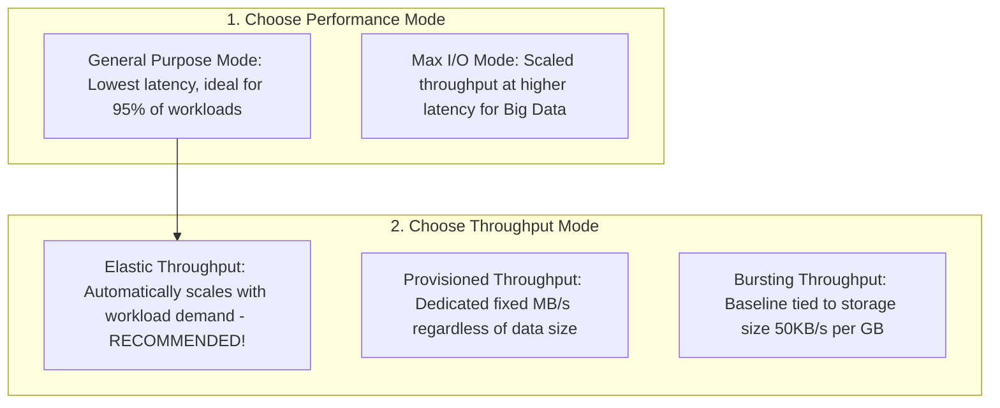
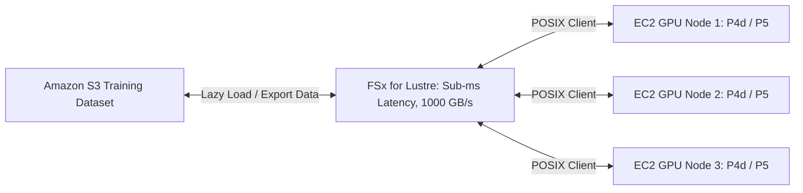
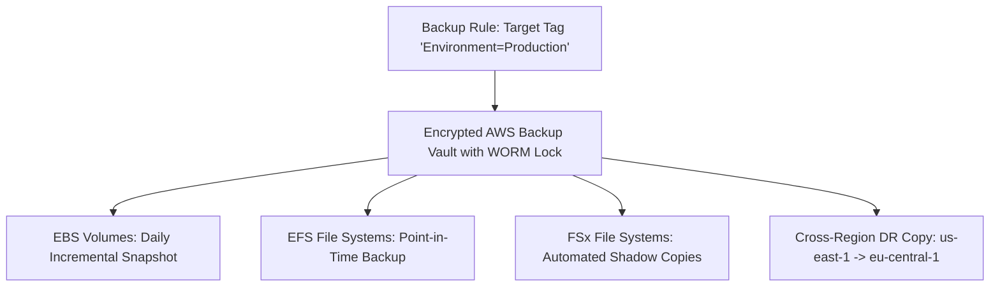

# AWS CloudOps: Managing & Optimizing Mountable Storage

> **Official Curriculum Reference:**
> Based on the AWS Skill Builder course **"AWS CloudOps Engineer: Managing and Optimizing Mountable Storage"**.

---

## 1. Technical Definition: Mountable Cloud Storage

> **Formal Technical Definition:**
> **Mountable Storage** in AWS encompasses all persistent and ephemeral storage technologies that can be directly attached and mounted as a block device or network file system by the operating system kernel of an Amazon EC2 instance, ECS container, or EKS pod. This includes **Block Storage** via NVMe/PCIe (**Amazon EBS** and **EC2 Instance Store**), **POSIX-compliant Elastic File Systems** via NFSv4 (**Amazon EFS**), and **High-Performance Specialized File Systems** via SMB, Lustre, ZFS, and ONTAP (**Amazon FSx**). Managing mountable storage requires optimizing the trade-offs between **IOPS**, **Throughput**, **Latency**, **Concurrency**, **Data Tiering**, and **Total Cost of Ownership (TCO)**.

### 1.1 The Conceptual Analogy (For Intuition)

*   **The Workshop Tools Analogy**:
    *   **Amazon EBS**: Like a dedicated, private workbench drawer for one craftsman. Ultra-fast, private, and holds your personal tools.
    *   **Amazon EFS**: Like a shared tool rack in the center of a busy factory. Thousands of workers can grab and return tools simultaneously without waiting.
    *   **Amazon FSx for Lustre**: Like an ultra-high-speed conveyor belt feeding materials directly into an industrial supercomputer or AI engine.
    *   **Amazon FSx for Windows**: Like an enterprise office filing cabinet integrated with corporate Microsoft Active Directory badges and permissions.
    *   **EC2 Instance Store**: Like a temporary whiteboard on your desk. Incredible speed for quick scribbles, but completely erased when you leave the office at night.

```
+---------------------------------------------------------------------------------------------------+
|                            AWS MOUNTABLE STORAGE ARCHITECTURE LANDSCAPE                           |
|                                                                                                   |
|  +---------------------------------------------------------------------------------------------+  |
|  |                             BLOCK-LEVEL STORAGE (Raw Disks)                                 |  |
|  |                                                                                             |  |
|  |   [ Amazon EBS ]                                  [ EC2 Instance Store ]                    |  |
|  |   - Persistent virtual SAN over NVMe fabric       - Direct physical host NVMe SSD           |  |
|  |   - Replicated in AZ (99.999% availability)       - Ephemeral scratchpad (Lost on stop!)    |  |
|  |   - Single-instance mount (OS boot, databases)    - Ultra-low latency, millions of IOPS     |  |
|  +---------------------------------------------------------------------------------------------+  |
|                                                                                                   |
|  +---------------------------------------------------------------------------------------------+  |
|  |                            SHARED FILE-LEVEL STORAGE (Network Mounts)                       |  |
|  |                                                                                             |  |
|  |   [ Amazon EFS ] (NFSv4)                          [ Amazon FSx Family ]                     |  |
|  |   - Elastic, serverless POSIX file system         - FSx for Windows (SMB, Active Directory) |  |
|  |   - Multi-AZ concurrent access (1000s of nodes)   - FSx for Lustre (HPC / ML / S3 Link)     |  |
|  |   - Automatic IA & Archive cold tiering           - FSx for NetApp ONTAP (Multi-protocol)   |  |
|  |                                                   - FSx for OpenZFS (Sub-ms Linux ZFS)      |  |
|  +---------------------------------------------------------------------------------------------+  |
+---------------------------------------------------------------------------------------------------+
```

---

## 2. Mountable Storage Master Comparison Matrix

| Storage Service | Protocol / Interface | Access Mode | Concurrency | Latency Profile | Lifecycle Tiering Support | Primary CloudOps Workload |
| :--- | :--- | :--- | :--- | :--- | :--- | :--- |
| **Amazon EBS** | NVMe Block protocol | Single Node (*Multi-Attach for cluster FS*) | 1 EC2 Instance | Sub-millisecond to low ms | Snapshot Archive (75% savings) | OS Boot Volumes, Relational DBs (PostgreSQL, Oracle), Transactional Apps. |
| **EC2 Instance Store** | PCIe Host Bus (Block) | Single Node | 1 EC2 Instance | Microsecond (Ultra-low) | None (Data lost on instance stop) | Temporary caches (Redis, Memcached), Hadoop scratch space, build buffers. |
| **Amazon EFS** | NFSv4.0 / NFSv4.1 | Multi-Node | 10,000+ Instances | Low single-digit ms | EFS Infrequent Access (IA) & Archive (90%+ savings) | Web server media assets, CI/CD shared workspaces, container home directories. |
| **FSx for Windows** | SMB 2.0 - 3.1.1 | Multi-Node | 1,000s of Instances | Sub-millisecond | HDD Storage + Data Deduplication + S3 Tiering | Enterprise Windows apps, Active Directory user shares, SQL Server failover clusters. |
| **FSx for Lustre** | POSIX / Lustre Client | Multi-Node | Millions of Cores | Sub-millisecond | Direct Bidirectional Sync with Amazon S3 | Machine Learning (SageMaker), AI training, Genomic sequencing, HPC simulations. |
| **FSx for ONTAP** | NFS, SMB, iSCSI | Multi-Node | Enterprise-wide | Sub-millisecond | Auto-Tiering to Capacity Pool (Up to 90% savings) | Enterprise SAN/NAS migration, NetApp SnapMirror replication, VMware Cloud. |
| **FSx for OpenZFS** | NFS (v3, v4.0-v4.2) | Multi-Node | 1,000s of Instances | Hundreds of $\mu\text{s}$ | ZFS Snapshots & Data Compression | Financial modelling, software build systems, digital media processing. |

---

## 3. Deep Dive: Amazon EFS Architecture & Optimization

### 3.1 Technical Definition: Amazon EFS
> **Technical Definition:**
> **Amazon Elastic File System (EFS)** is a serverless, fully elastic, multi-AZ network file system supporting standard **NFSv4.0 and NFSv4.1** protocols. It automatically expands and shrinks on demand up to petabytes without provisioning storage capacity. Files are replicated redundantly across multiple Availability Zones to provide $99.999999999\%$ (11 nines) durability.

### 3.2 Performance Modes vs Throughput Modes



### 3.3 EFS Cost Optimization: Lifecycle Management & Storage Tiers

```
+-----------------------------------------------------------------------------------+
|                             EFS LIFECYCLE MANAGEMENT                              |
|                                                                                   |
|  [ EFS Standard Tier ]          ===> High-frequency active reads/writes           |
|      ($0.30 / GB-month)                                                           |
|             |                                                                     |
|             v (Transition after 30 days without read access)                      |
|  [ EFS Infrequent Access (IA) ] ===> 92% Cheaper ($0.025 / GB-month)              |
|             |                                                                     |
|             v (Transition after 90 days without read access)                      |
|  [ EFS Archive Tier ]           ===> 97% Cheaper ($0.011 / GB-month)              |
|                                                                                   |
|  * Intelligent Tiering: If an IA/Archive file is read, it moves back to Standard!  |
+-----------------------------------------------------------------------------------+
```

---

## 4. Deep Dive: The Amazon FSx Family

### 4.1 FSx for Windows File Server
*   **Protocol**: Native Microsoft SMB.
*   **Enterprise Features**: Fully joined to **AWS Directory Service** or on-premises **Active Directory (AD)**, supporting Windows Access Control Lists (ACLs), Shadow Copies (VSS), and DFS Namespaces.
*   **Cost Optimization**: Built-in **Data Deduplication** saves $50\% - 60\%$ storage space by removing duplicate blocks across corporate file shares.

### 4.2 FSx for Lustre (HPC & AI Workloads)
*   **Protocol**: High-performance Lustre client.
*   **S3 Integration**: Automatically pre-loads file metadata from an **Amazon S3 bucket**, processes calculations across thousands of EC2 compute nodes at hundreds of GB/s, and streams results directly back to S3.



---

## 5. Right-Sizing & Optimization with AWS Compute Optimizer

> **Technical Definition:**
> **AWS Compute Optimizer** leverages machine learning algorithms to analyze historical Amazon CloudWatch utilization metrics (over a 14-day or 93-day lookback window) to detect over-provisioned and under-provisioned EBS volumes, EC2 instances, and Lambda functions.

### CloudOps Decision Framework:
1.  **Over-Provisioned EBS Volumes**: High provisioned IOPS/throughput on `gp3` or `io2` that are never utilized ($< 10\%$ peak utilization). Action: Downscale provisioned IOPS to free baseline (3,000 IOPS / 125 MB/s) to save budget.
2.  **Under-Provisioned Volumes**: High `VolumeQueueLength` and frequent latency spikes. Action: Increase provisioned IOPS or upgrade to `io2 Block Express`.
3.  **Legacy Volume Migrations**: Identifies all un-migrated `gp2` volumes and outputs automated migration scripts to convert them to `gp3`.

---

## 6. Centralized Backup Automation: AWS Backup

Instead of managing separate snapshot policies across EBS, EFS, and FSx, CloudOps standardizes on **AWS Backup**:



*   **AWS Backup Vault Lock (WORM Compliance)**: Enforces "Write Once, Read Many" compliance. Even an AWS Root account cannot delete backups before the retention window expires (prevents ransomware destruction).

---

## 7. CloudOps Linux Runbook: Mounting EFS & FSx

### Scenario A: Mounting Amazon EFS on Linux via the EFS Mount Helper

```bash
# 1. Install the official Amazon EFS Client utilities
sudo yum install -y amazon-efs-utils
# (On Ubuntu: sudo apt-get install -y amazon-efs-utils)

# 2. Create the target mount directory
sudo mkdir -p /mnt/shared-efs

# 3. Mount EFS securely with TLS encryption in transit
sudo mount -t efs -o tls,iam fs-0123456789abcdef0:/ /mnt/shared-efs

# 4. Configure permanent mount in /etc/fstab safely (ALWAYS use '_netdev' and 'nofail')
# '_netdev' ensures Linux waits for the network stack to be UP before attempting mount!
echo "fs-0123456789abcdef0:/  /mnt/shared-efs  efs  _netdev,tls,iam,nofail  0  0" | sudo tee -a /etc/fstab

# 5. Verify mount
df -hT /mnt/shared-efs
```

---

### Scenario B: Mounting FSx for Lustre on Linux

```bash
# 1. Install the Lustre client packages
sudo amazon-linux-extras install -y lustre
# (On Amazon Linux 2023: sudo dnf install -y kmod-lustre-client lustre-client)

# 2. Create mount point
sudo mkdir -p /mnt/fsx-lustre

# 3. Mount using the Lustre MGS IP and Mount Name
sudo mount -t lustre -o noatime,flock fs-0123456789abcdef0.fsx.us-east-1.amazonaws.com@tcp:/fsx /mnt/fsx-lustre

# 4. Verify high-speed mount
df -hT /mnt/fsx-lustre
```

---

## 8. Summary Checklist for Mountable Storage CloudOps

- [x] **Match Workload to Storage Type**: EBS for single-node DB/OS; EFS for multi-node Linux NFS; FSx for Windows/Lustre/ONTAP.
- [x] **Enable EFS Lifecycle Management**: Auto-transition cold files to Infrequent Access (IA) to save up to 92%.
- [x] **Always use `_netdev,nofail`** in `/etc/fstab` for network-mounted filesystems.
- [x] **Review AWS Compute Optimizer Monthly** to right-size over-provisioned EBS volumes.
- [x] **Deploy AWS Backup Vault Lock** for immutable ransomware protection across all storage resources.
