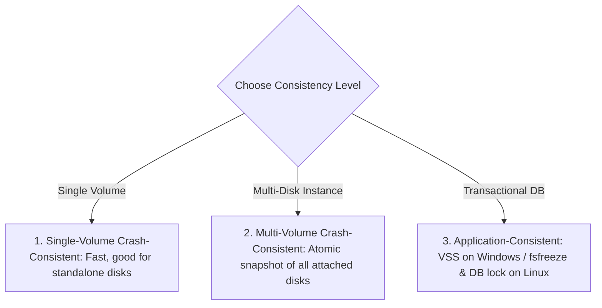
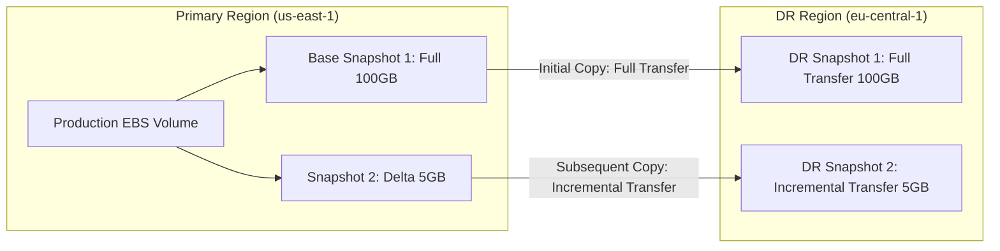

# AWS EBS Snapshots: Backup, Cross-Region DR & Fast Restoration Guide

> **Official AWS Skill Builder Summary:**
> Concise reference covering EBS snapshot creation strategies, consistency levels, cross-Region disaster recovery replication, tagging schemas, and performance optimization (Pre-warming vs Fast Snapshot Restore).

---

## 1. Technical Definition: Amazon EBS Snapshots

> **Formal Technical Definition:**
> An **Amazon EBS Snapshot** is a point-in-time, crash-consistent, incremental block-level backup of an EBS volume stored redundantly across multiple Availability Zones in **Amazon S3**. Snapshots utilize a **redirect-on-write** tracking mechanism: only blocks changed since the previous snapshot are saved, significantly reducing storage consumption and transfer overhead while allowing any snapshot in the chain to independently restore a complete volume.

### 1.1 The Conceptual Analogy (For Intuition)

*   **The Difference Between Full Backup vs Incremental Snapshot**:
    *   *Traditional Backup*: Photocopying an entire 500-page book every single night (slow, massive storage waste).
    *   *EBS Incremental Snapshot*: Day 1 you photocopy the full 500-page book. Day 2 you only photocopy the 3 pages you edited. AWS tracks the pointers so when you restore Day 2, you instantly get the full 500-page book seamlessly.

```
+---------------------------------------------------------------------------------------------------+
|                              EBS INCREMENTAL SNAPSHOT TIMELINE                                    |
|                                                                                                   |
|  [ Original Volume: 100 GB ]                                                                      |
|  - Blocks: [A][B][C][D]                                                                           |
|                                                                                                   |
|  Snapshot 1 (Day 1): [A][B][C][D]  =======> Full Copy (100 GB stored in S3)                       |
|                                                                                                   |
|  * User modifies Block B -> B1                                                                    |
|                                                                                                   |
|  Snapshot 2 (Day 2):       [B1]    =======> Incremental Delta (Only 5 GB changed block stored)    |
|                                             (Pointers reference A, C, D from Snapshot 1)          |
+---------------------------------------------------------------------------------------------------+
```

---

## 2. Snapshot Creation Strategies & Consistency Levels



### 2.1 The 3 Snapshot Consistency Levels

| Consistency Level | Operating Mechanism | Best Suited Workload | Operational Command / Tool |
| :--- | :--- | :--- | :--- |
| **Single-Volume Crash-Consistent** | Captures blocks committed to disk. Unwritten data in OS RAM buffer cache is lost. | Standalone OS boot drives, non-transactional file shares. | `aws ec2 create-snapshot` |
| **Multi-Volume Crash-Consistent** | Takes an exact point-in-time, synchronized snapshot across **all EBS volumes** attached to an EC2 instance simultaneously. | RAID arrays, LVM striping, stateful instances spanning multiple disks. | `aws ec2 create-snapshots --instance-specification ...` |
| **Application-Consistent** | Pauses write I/O, flushes in-memory dirty pages, and executes DB checkpointing before freezing disk. | Production Databases (PostgreSQL, Oracle, SQL Server, MySQL). | **Linux**: `fsfreeze -f` + DB lock.<br>**Windows**: AWS VSS (Volume Shadow Copy Service). |

---

## 3. Standardized Tagging & Naming Best Practices

Consistent tagging enables automated retention policies, cost center chargebacks, and compliance audits:

```
Example Naming Convention:
<environment>-<application>-<timestamp>-<purpose>
prod-customerdb-2026-08-22-0300-scheduled
```

### 3.1 Recommended CloudOps Tagging Schema

| Tag Key | Example Value | Operational Purpose |
| :--- | :--- | :--- |
| **`Name`** | `prod-customerdb-daily-20260822` | Human-readable identification in AWS Console and CLI. |
| **`Environment`** | `Production` / `Staging` / `Development` | Environment tier isolation and filtering. |
| **`Application`** | `CustomerDB` / `PaymentGateway` | Maps snapshot to service architecture. |
| **`BackupType`** | `Daily` / `Weekly` / `Pre-Patch` | Differentiates automated schedules from manual pre-change backups. |
| **`RetainUntil`** | `2026-09-22` | Target date for automated lifecycle pruning scripts. |
| **`ConsistencyGroup`** | `customer-db-cluster-01` | Groups multi-volume snapshots belonging to the same application cluster. |
| **`SourceVolume`** | `vol-0123456789abcdef0` | Direct lineage tracking back to the originating block device. |

---

## 4. Cross-Region Disaster Recovery (DR) Management

Replicating snapshots geographically isolates critical backups from regional AWS outages.



### 4.1 Cross-Region Cost & Performance Rules
1.  **Initial Copy is Full**: The very first time a snapshot is copied to a destination Region, AWS transfers the **full volume data**.
2.  **Subsequent Copies are Incremental**: As long as the base snapshot remains in the destination Region, subsequent copies transfer **only changed blocks**, reducing transfer time and bandwidth fees.
3.  **Inter-Region Data Transfer Cost**: Egress data transfer fees apply per gigabyte transferred between AWS Region pairs.
4.  **Encryption Transformation**: You can re-encrypt unencrypted snapshots or switch KMS keys during the cross-region copy process.

---

## 5. Volume Restoration Performance: Pre-Warming vs Fast Snapshot Restore (FSR)

> **The Problem: First-Touch Penalty (Lazy Loading)**
> When you create a volume from an EBS snapshot, the volume is immediately accessible. However, storage blocks reside in Amazon S3 and are pulled down **lazily upon first read access**. The first read to any block incurs a **$10 - 100\text{ ms}$ latency penalty**.

```
+---------------------------------------------------------------------------------------------------+
|                                FIRST-TOUCH LATENCY SOLUTIONS                                      |
|                                                                                                   |
|  Approach A: Manual Volume Pre-Warming              Approach B: Fast Snapshot Restore (FSR)       |
|  - Zero extra AWS hourly cost                       - Instant full provisioned performance        |
|  - Must read all blocks into /dev/null              - Eliminates lazy-load latency completely     |
|  - Best for: Non-urgent recovery, dev/staging       - Best for: Mission-critical DBs, low RTO     |
+---------------------------------------------------------------------------------------------------+
```

### 5.1 Comparison: Pre-Warming vs Fast Snapshot Restore (FSR)

| Feature | Manual Volume Pre-Warming | Fast Snapshot Restore (FSR) |
| :--- | :--- | :--- |
| **Mechanism** | OS reads all raw sectors sequentially (`dd` or `fio`). | AWS storage infrastructure pre-hydrates blocks in background. |
| **Time to Full Performance** | Takes minutes to hours depending on volume size ($1\text{ TB} \approx 1 - 2\text{ hours}$). | **Immediate (0 seconds first-touch delay)**. |
| **AWS Cost** | Free (standard EBS volume hourly charges only). | Additional hourly fee per AZ per enabled snapshot ($\approx \$0.75/\text{hour/AZ}$). |
| **Credit Bucket Mechanism**| None. | FSR bucket fills with 1 credit per hour per AZ (max 10 credits). 1 restore consumes 1 credit. |
| **Primary Use Case** | Scheduled maintenance, test environments, non-urgent DR. | **Disaster recovery (Low RTO)**, Auto-Scaling Groups, High-transaction OLTP. |

---

## 6. Hands-On CloudOps Command Runbook

### 6.1 Creating Application-Consistent Snapshots on Linux

```bash
# 1. Flush file system dirty buffers and freeze I/O writes
sudo fsfreeze -f /data

# 2. Create the snapshot via AWS CLI with standard metadata tags
aws ec2 create-snapshot \
  --volume-id vol-0123456789abcdef0 \
  --description "prod-customerdb-pre-patch-backup" \
  --tag-specifications 'ResourceType=snapshot,Tags=[{Key=Name,Value=prod-customerdb-20260822},{Key=Environment,Value=Production},{Key=BackupType,Value=Pre-Patch}]'

# 3. Unfreeze I/O writes immediately after API confirms snapshot initiation
sudo fsfreeze -u /data
```

---

### 6.2 Multi-Volume Atomic Snapshot (Entire Instance)

```bash
# Atomic snapshot across all volumes attached to an instance
aws ec2 create-snapshots \
  --instance-specification InstanceId=i-0123456789abcdef0 \
  --description "prod-app-server-full-instance-backup" \
  --tag-specifications 'ResourceType=snapshot,Tags=[{Key=Environment,Value=Production},{Key=ConsistencyGroup,Value=app-cluster-01}]'
```

---

### 6.3 Copying Snapshots Across Regions with KMS Encryption

```bash
# Copy snapshot from us-east-1 to eu-central-1 and encrypt with destination KMS CMK
aws ec2 copy-snapshot \
  --source-region us-east-1 \
  --source-snapshot-id snap-0123456789abcdef0 \
  --destination-region eu-central-1 \
  --kms-key-id arn:aws:kms:eu-central-1:123456789012:key/your-destination-kms-key-id \
  --encrypted \
  --description "eu-central-1-dr-replica"
```

---

### 6.4 Enabling Fast Snapshot Restore (FSR)

```bash
# Enable FSR on a critical snapshot in target Availability Zones
aws ec2 enable-fast-snapshot-restores \
  --availability-zones us-east-1a us-east-1b \
  --source-snapshot-ids snap-0123456789abcdef0
```

---

### 6.5 Manual Volume Pre-Warming (Linux)

```bash
# Pre-warm entire disk sequentially to eliminate first-touch S3 lazy load penalty
sudo dd if=/dev/nvme1n1 of=/dev/null bs=1M status=progress
```

---

## 7. Terraform Implementation: Automated Snapshot & Cross-Region DR Policy

```hcl
# ==============================================================================
# AWS Data Lifecycle Manager (DLM) Snapshot Policy with Cross-Region Copy
# ==============================================================================
resource "aws_dlm_lifecycle_policy" "production_db_backup_policy" {
  description        = "Daily Production Snapshot with Cross-Region DR Replication"
  execution_role_arn = aws_iam_role.dlm_lifecycle_role.arn
  state              = "ENABLED"

  policy_details {
    resource_types = ["VOLUME"]

    target_tags = {
      BackupSchedule = "daily-production"
    }

    schedule {
      name = "DailySnapshotAt0200UTC"

      create_rule {
        interval      = 24
        interval_unit = "HOURS"
        times         = ["02:00"]
      }

      retain_rule {
        count = 30 # Retain 30 daily snapshots in primary region
      }

      tags_to_add = {
        SnapshotCreator = "AWS-DLM-Automation"
        Environment     = "Production"
      }

      # Cross-Region DR Copy to eu-central-1
      cross_region_copy_rule {
        target    = "eu-central-1"
        encrypted = true
        cmk_arn   = var.destination_region_kms_key_arn

        retain_rule {
          interval      = 90
          interval_unit = "DAYS"
        }
      }
    }
  }
}
```

---

## 8. Summary Checklist for EBS Snapshot Operations

- [x] **Enforce Application Consistency**: Always use `fsfreeze` (Linux) or VSS (Windows) on active databases prior to snapshotting.
- [x] **Snapshot All Disks Simultaneously**: Use `aws ec2 create-snapshots` for instances spanning multiple volumes to maintain crash consistency.
- [x] **Leverage Incremental Replication**: Maintain base snapshots in DR regions to minimize cross-region data transfer time and egress costs.
- [x] **Enable FSR for Low-RTO Systems**: Activate Fast Snapshot Restore on mission-critical snapshots to eliminate first-touch latency during emergencies.
- [x] **Automate with DLM or AWS Backup**: Eliminate manual console snapshots in favor of tag-based Infrastructure as Code policies.
