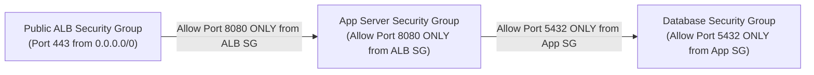

# Managing AWS VPC with Terraform — Beginner to CloudOps Guide

---

## 1. Technical Definition: Software-Defined Networking as Code

> **Formal Technical Definition:**
> **Software-Defined Networking as Code (SDN-as-Code)** is the automated provisioning, topology design, and policy management of virtual networks using declarative Infrastructure as Code (IaC). In AWS, defining a Virtual Private Cloud (VPC) via Terraform guarantees mathematically non-overlapping CIDR address schemes, deterministic Multi-AZ subnet allocations across discrete Availability Zones, explicit route table associations, automated egress gateway provisioning (Internet Gateway and NAT Gateways), and declarative stateful/stateless packet filtering via chained Security Group rules and NACLs.

### 1.1 The Conceptual Analogy (For Intuition)

*   **The Master Campus Blueprint**:
    *   *ClickOps (The Manual Way)*: Configuring 25+ networking components across subnets, route tables, elastic IPs, and NAT gateways in the AWS Console leads to missing route associations, exposed databases, and configuration drift.
    *   *Terraform (The Code Blueprint)*: You write the 3-Tier Multi-AZ architecture once in code (`main.tf`, `gateways.tf`, `routes.tf`). Terraform builds and wires the entire isolated network and chained security groups in 90 seconds without human error.

```
+---------------------------------------------------------------------------------------------------+
|                            TERRAFORM 3-TIER VPC RESOURCE HIERARCHY                                |
|                                                                                                   |
|                                     [ aws_vpc ]                                                   |
|                                 (CIDR: 10.0.0.0/16)                                               |
|                                          |                                                        |
|        +---------------------------------+---------------------------------+                      |
|        |                                 |                                 |                      |
|        v                                 v                                 v                      |
| [ 2x Public Subnets ]         [ 2x Private App Subnets ]       [ 2x Isolated DB Subnets ]         |
| (10.0.1.0/24, 10.0.2.0/24)    (10.0.10.0/24, 10.0.20.0/24)     (10.0.100.0/24, 10.0.200.0/24)     |
|        |                                 |                                 |                      |
|        v                                 v                                 v                      |
| [ aws_internet_gateway ]      [ aws_nat_gateway (x2) ]         [ Local Route Only ]               |
| (0.0.0.0/0 -> IGW)            (0.0.0.0/0 -> NAT GW)            (No Internet Access!)              |
|                                          |                                                        |
|                                          v                                                        |
|                           [ aws_vpc_endpoint (S3 Gateway) ]                                       |
|                              (Free Direct S3 Private Link)                                        |
+---------------------------------------------------------------------------------------------------+
```

---

## 2. Core Terraform Resources for AWS Networking

| Terraform Resource | Technical Purpose | CloudOps Production Role |
| :--- | :--- | :--- |
| `aws_vpc` | Provisions software-defined virtual network boundary. | **Must set `enable_dns_hostnames = true`** and `enable_dns_support = true`. |
| `aws_subnet` | Allocates discrete IP sub-ranges bound to specific AZs. | Set `map_public_ip_on_launch = true` strictly on Public subnets. |
| `aws_internet_gateway` | Horizontally scaled, redundant VPC edge router. | Enables 2-way public internet communication. |
| `aws_nat_gateway` | Managed Network Address Translation device in public subnet. | Enables one-way outbound internet access for private subnets. |
| `aws_route_table` & `aws_route_table_association` | Software routing table directing egress/ingress traffic. | Explicitly bound to each subnet to enforce traffic policies. |
| `aws_vpc_endpoint` | Direct private route to AWS service endpoints (S3/DynamoDB). | Bypasses NAT Gateways to eliminate data processing fees ($0.00/GB). |
| `aws_security_group` | Stateful Layer 4 packet filter attached to ENIs. | Chained together via `security_groups` to create zero-trust architectures. |

---

## 3. Production Security: Self-Referencing Chained Security Groups



```hcl
# Database accepts connections STRICTLY from App Server Security Group
resource "aws_security_group" "db_sg" {
  name        = "sg-production-isolated-db"
  description = "Allows PostgreSQL traffic strictly from Application Servers"
  vpc_id      = aws_vpc.main.id

  ingress {
    description     = "Allow PostgreSQL (5432) ONLY from App Server SG"
    from_port       = 5432
    to_port         = 5432
    protocol        = "tcp"
    security_groups = [aws_security_group.app_sg.id] # CHAINED SECURITY GROUP!
  }

  egress {
    description = "Restricted outbound to VPC only"
    from_port   = 0
    to_port     = 0
    protocol    = "-1"
    cidr_blocks = [aws_vpc.main.cidr_block]
  }
}
```

---

## 4. Real-World Disasters & CloudOps Safeguards in Terraform

### 💥 Disaster 1: The "DNS Resolution Blackout"
*   **The Issue**: Omitting `enable_dns_hostnames = true` on `aws_vpc` causes AWS to disable internal DNS hostname resolution.
*   **The Result**: RDS PostgreSQL/MySQL endpoints fail to resolve, causing `UnknownHostException` application outages.
*   **The CloudOps Safeguard**: Always set `enable_dns_hostnames = true` and `enable_dns_support = true`.

### 💥 Disaster 2: The Overlapping CIDR Block Trap
*   **The Issue**: Creating multiple VPCs with identical `10.0.0.0/16` CIDR blocks.
*   **The Result**: Future VPC Peering and AWS Transit Gateway attachments are mathematically impossible without complete network re-architecture.
*   **The CloudOps Safeguard**: Establish an organizational IP Address Management (IPAM) scheme.

---

## 5. Beginner Checklist for AWS VPC in Terraform

- [x] **Set `enable_dns_hostnames = true`** on `aws_vpc`.
- [x] **Deploy Multi-AZ subnets** across at least 2 Availability Zones.
- [x] **Deploy a FREE S3 VPC Gateway Endpoint** to eliminate NAT processing costs.
- [x] **Chain Security Groups together** using `security_groups = [...]`.
- [x] **Ensure Isolated DB subnets have NO 0.0.0.0/0 route**.
