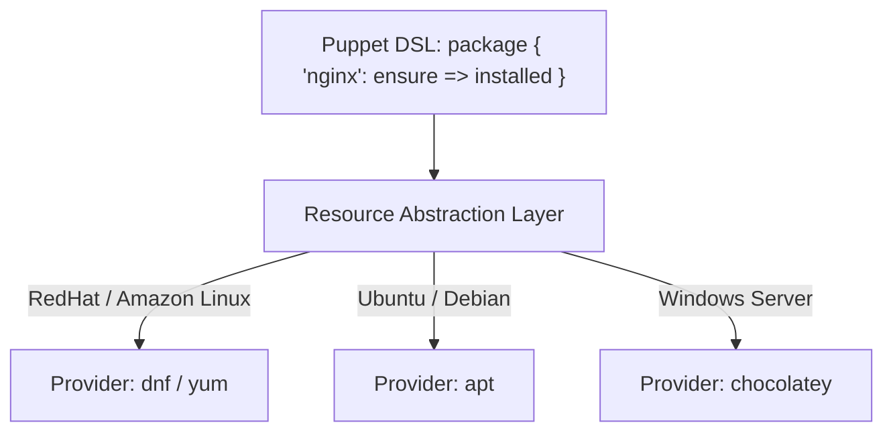
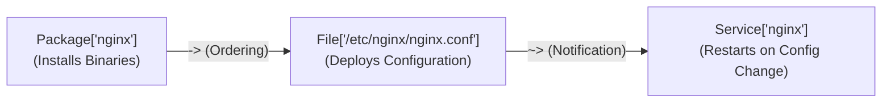

# Puppet Configuration Management — Beginner to CloudOps Pro Guide

---

## 1. Technical Definition: Puppet Configuration Management

> **Formal Technical Definition:**
> **Puppet** is an enterprise-grade, model-driven, declarative **Configuration Management (CM)** and infrastructure automation platform. It uses a specialized Ruby-based Domain-Specific Language (**Puppet DSL**) to define the desired target state of computing infrastructure. Operating on a **Client-Server (Master-Agent)** or **Masterless (Apply)** architecture, Puppet continuously enforces system state, provides automatic configuration drift correction, and abstracts underlying operating system differences (e.g., `apt` vs `dnf`, `systemd` vs `init`) through its proprietary **Resource Abstraction Layer (RAL)**. State evaluation is strictly **idempotent**, ensuring repeated executions produce zero unintended side-effects.

### 1.1 The Conceptual Analogy (For Intuition)

*   **The Master Architect & The Construction Foreman**:
    *   *The Puppet Server (The Master Architect)*: Holds the central architectural blueprint (`manifests`). It compiles a customized job specification list (`catalog`) tailored for each specific building.
    *   *The Puppet Agent (The Construction Foreman on site)*: Runs directly on the server every 30 minutes. It inspects the room, compares every single door, pipe, and electrical wire against the architect's blueprint, and if anyone moved a wire or tampered with a lock (**Configuration Drift**), the foreman puts it right back where the blueprint dictates.

```
+---------------------------------------------------------------------------------------------------+
|                                 PUPPET MASTER-AGENT ARCHITECTURE                                  |
|                                                                                                   |
|  +---------------------------------------------------------------------------------------------+  |
|  |                             PUPPET SERVER (PUPPET MASTER)                                   |  |
|  |                                                                                             |  |
|  |   [ Manifests (.pp) ]       [ Hiera Data (YAML) ]       [ Templates (EPP/ERB) ]             |  |
|  |             \                         |                         /                           |  |
|  |              +------------------------+------------------------+                            |  |
|  |                                       |                                                     |  |
|  |                          [ ⚙️ Catalog Compiler Engine ]                                      |  |
|  |                                       |                                                     |  |
|  +---------------------------------------|-----------------------------------------------------+  |
|                     ^ (1. Sends Facts)   |   (2. Compiles & Returns                              |
|                     |                    |       Signed Catalog)                                 |
|                     |                    v                                                       |
|  +---------------------------------------|-----------------------------------------------------+  |
|  |  PUPPET AGENT (Managed Node)          v                                                     |  |
|  |                                                                                             |  |
|  |   +-------------------+     +--------------------+     +--------------------------------+   |  |
|  |   |   1. FACTER       |     |  3. RAL ENFORCER   |     |  4. REPORT GENERATOR           |   |  |
|  |   | Gathers OS, IP,   |     | Enforces Package,  |     | Sends run summary (Success,    |   |  |
|  |   | Memory, Hostname  |     | File, Service state|     | Corrected Drift, Failures)     |   |  |
|  |   +-------------------+     +--------------------+     +---------------+----------------+   |  |
|  |                                                                        |                    |  |
|  +------------------------------------------------------------------------|--------------------+  |
|                                                                           v (3. Sends Run Report) |
|                                                        [ 📊 PuppetDB / Monitoring Console ]        |
+---------------------------------------------------------------------------------------------------+
```

---

## 2. The 4-Step Puppet Catalog Compilation Lifecycle

Every 30 minutes (the default interval), the Puppet Agent executes a deterministic 4-phase transaction cycle with the Puppet Server:

```
[ Phase 1: Fact Collection ]   Agent runs Facter to gather OS, memory, IP, and node identity.
              |
              v (Sends facts over mTLS port 8140)
[ Phase 2: Catalog Compile ]   Puppet Server matches facts against manifests & Hiera to compile a Catalog.
              |
              v (Returns compiled SQLite-like dependency graph)
[ Phase 3: State Enforcement ] Agent evaluates local resources against the Catalog and corrects drift.
              |
              v (Calculates diffs & applies changes)
[ Phase 4: Report Submission ] Agent uploads detailed run metrics (Unchanged, Corrected, Failed) to Server.
```

### 2.1 Technical Definitions of Core Lifecycle Components

1.  **Facter**:
    *   *Technical Definition*: A cross-platform system profiling library that discovers and reports node-level variables (known as **Facts**) such as `networking.ip`, `os.family`, `memory.system.total`, and `processors.count`.
    *   *Analogy*: The ID card and medical chart describing the server's current physical condition.
2.  **Catalog**:
    *   *Technical Definition*: A pre-compiled, acyclic directed dependency graph generated by the Puppet Server that lists all resources, their desired states, and their evaluation relationships (`require`, `before`, `notify`, `subscribe`) for a specific node.
    *   *Analogy*: The customized, stamped checklist the foreman carries into the room.
3.  **Idempotency**:
    *   *Technical Definition*: The mathematical property whereby an operation can be applied multiple times without changing the result beyond the initial application ($$f(f(x)) = f(x)$$).
    *   *CloudOps Impact*: If a file is already in the desired state, Puppet does nothing ($0 \text{ changes}$). If someone maliciously edits the file, Puppet restores the desired state.

---

## 3. The Resource Abstraction Layer (RAL)

> **Technical Definition:**
> The **Resource Abstraction Layer (RAL)** separates the *declarative interface* of a system resource from its underlying *operating-system-specific implementation* (**Types and Providers**).

### 3.1 RAL Types and Providers Example

You write a single universal declaration in Puppet DSL:

```puppet
package { 'nginx':
  ensure => installed,
}
```

Behind the scenes, the RAL automatically selects the appropriate **Provider**:
*   On **RedHat / CentOS / Amazon Linux 2023** $\rightarrow$ Invokes `dnf install -y nginx` or `yum install -y nginx`.
*   On **Debian / Ubuntu** $\rightarrow$ Invokes `apt-get install -y nginx`.
*   On **macOS** $\rightarrow$ Invokes `brew install nginx`.
*   On **Windows Server** $\rightarrow$ Invokes `chocolatey install nginx`.



---

## 4. Core Puppet DSL Syntax & Resource Declarations

### 4.1 Anatomy of a Resource Declaration

Every Puppet resource follows this strict syntax:

```puppet
type { 'title':
  attribute_one => 'value',
  attribute_two => 'value',
}
```

### 4.2 The 6 Essential Core Resource Types

#### 1. The `package` Resource (Software Installation)
```puppet
package { 'nginx':
  ensure => '1.24.0-1.el9', # Can be: installed, latest, absent, purged, or exact version
}
```

#### 2. The `file` Resource (Files, Directories, Symlinks, Permissions)
```puppet
file { '/etc/nginx/nginx.conf':
  ensure  => file,             # Can be: file, directory, link, absent
  owner   => 'root',
  group   => 'root',
  mode    => '0644',           # Read/write for root, read for others
  content => template('nginx/nginx.conf.erb'), # Or source => 'puppet:///modules/nginx/nginx.conf'
}
```

#### 3. The `service` Resource (Daemon Management)
```puppet
service { 'nginx':
  ensure     => running,       # Can be: running, stopped
  enable     => true,          # Automatically start on system boot (systemctl enable)
  hasrestart => true,
  hasstatus  => true,
}
```

#### 4. The `user` and `group` Resources (System Accounts)
```puppet
group { 'devops':
  ensure => present,
  gid    => 2001,
}

user { 'deployer':
  ensure     => present,
  uid        => 2001,
  gid        => 'devops',
  home       => '/home/deployer',
  managehome => true,
  shell      => '/bin/bash',
}
```

#### 5. The `cron` Resource (Scheduled Cron Jobs)
```puppet
cron { 'database_backup_nightly':
  ensure  => present,
  command => '/usr/local/bin/backup-db.sh > /dev/null 2>&1',
  user    => 'root',
  hour    => '02',
  minute  => '30',
}
```

#### 6. The `exec` Resource (Raw Shell Execution - Use with Extreme Caution!)
> [!WARNING]
> **The Idempotency Hazard of `exec`:**
> Raw shell commands are not naturally idempotent. You **must** provide `onlyif` or `unless` guards to prevent the command from running on every 30-minute Puppet run!

```puppet
exec { 'extract_application_tarball':
  command => '/usr/bin/tar -xzf /tmp/app-v2.tar.gz -C /opt/app/',
  creates => '/opt/app/bin/start.sh', # Only runs if this file does NOT exist yet!
  # Or use: unless => '/usr/bin/test -d /opt/app/bin'
}
```

---

## 5. Resource Relationships & Metaparameters (The "Trifecta" Pattern)

In Puppet, resources are **not executed top-to-bottom** like a Bash script. They are compiled into a dependency graph. You must explicitly define relationships.

### 5.1 The 4 Metaparameters

| Metaparameter | Technical Definition | Operational Purpose |
| :--- | :--- | :--- |
| `require` | Resource B will not execute until Resource A successfully completes. | Ensures the package is installed before writing its config file. |
| `before` | Resource A must execute before Resource B. | Inverse of `require`. |
| `notify` | If Resource A changes state, it triggers a **refresh/restart** on Resource B. | Restarts a service whenever its configuration file is updated. |
| `subscribe` | Resource B monitors Resource A and refreshes itself if Resource A changes. | Inverse of `notify`. |

### 5.2 Relationship Chaining Arrows (`->` vs `~>`)

*   **Ordering Arrow (`->`)**: Enforces execution order ($A \rightarrow B$).
*   **Notification Arrow (`~>`)**: Enforces execution order **AND** triggers a service restart if the source file changed ($A \leadsto B$).

### 5.3 The Standard "Trifecta" Pattern (Package - Config - Service)

This is the most common pattern in all of Configuration Management:

```puppet
# ==============================================================================
# The Enterprise Trifecta Pattern in Puppet DSL
# ==============================================================================
package { 'nginx':
  ensure => installed,
}

file { '/etc/nginx/nginx.conf':
  ensure  => file,
  owner   => 'root',
  group   => 'root',
  mode    => '0644',
  source  => 'puppet:///modules/nginx/nginx.conf',
  require => Package['nginx'], # 1. Wait for package to install first!
  notify  => Service['nginx'], # 2. Restart service ONLY if file changes!
}

service { 'nginx':
  ensure => running,
  enable => true,
}

# ------------------------------------------------------------------------------
# Alternatively, express the exact same relationship with chaining arrows:
# ------------------------------------------------------------------------------
# Package['nginx'] -> File['/etc/nginx/nginx.conf'] ~> Service['nginx']
```



---

## 6. Real-World Incident 1: The "Service Restart Loop" Outage

### What Happened?
A junior engineer wrote a manifest where an `exec` resource constantly modified file timestamps, and was tied to a `notify => Service['apache2']`.
*   Every 30 minutes, when the Puppet Agent woke up, the `exec` ran unconditionally.
*   Puppet flagged the resource as "Changed" and sent a restart signal to `apache2`.
*   **Result**: Apache restarted every 30 minutes on 200 production servers, dropping active user shopping cart sessions and terminating long-running database connections.

```
Puppet Run (00:00) ===> Modifies timestamp ===> Restarts Apache! (Outage)
Puppet Run (00:30) ===> Modifies timestamp ===> Restarts Apache! (Outage)
Puppet Run (01:00) ===> Modifies timestamp ===> Restarts Apache! (Outage)
```

### The CloudOps Fix:
1. Replace `exec` with a native `file` resource.
2. Ensure resources only notify services when their underlying cryptographic checksum (`md5`/`sha256`) actually changes!

---

## 7. Real-World Incident 2: Configuration Drift Auto-Healed at 3 AM

### Technical Scenario:
At 2:45 AM, an unauthorized administrator SSHed into a production payment server and manually changed `/etc/ssh/sshd_config` to allow password authentication for root:
`PermitRootLogin yes`

### How Puppet Responded Automatically:
1. At 3:00 AM, the scheduled **Puppet Agent** daemon woke up and compiled the signed catalog.
2. The agent compared the MD5 checksum of `/etc/ssh/sshd_config` against the master blueprint (`PermitRootLogin no`).
3. Detecting drift, Puppet immediately overwrote `/etc/ssh/sshd_config` with the secure version, set file permissions back to `0600`, notified `Service['sshd']` to reload, and uploaded a security drift audit report to **PuppetDB**.
4. **Result**: The rogue security vulnerability existed for only 15 minutes before automated self-healing resolved it with zero human intervention.

---

## 8. Puppet vs Ansible vs Chef Comparison Matrix

| Feature | Puppet | Ansible | Chef |
| :--- | :--- | :--- | :--- |
| **Execution Model** | **Pull (Agent-based)** *(Default)* or Push (`puppet apply`). | **Push (Agentless)** over SSH/WinRM. | **Pull (Agent-based)**. |
| **Language Paradigm** | **Declarative DSL** (Specify *what* state should be). | **Procedural YAML** (Specify *steps* in order). | **Procedural Ruby DSL** (Code-centric recipes). |
| **Drift Management** | **Continuous automated enforcement** (Runs every 30 mins). | **Manual / Triggered via CI/CD** (Drift remains until playbook runs). | **Continuous automated enforcement**. |
| **State Storage** | **PuppetDB** (Centralized SQL state repository). | Stateless (Inventory files & facts memory). | **Chef Server**. |
| **Best Used For** | Large enterprise fleets (5,000+ servers), strict compliance, drift remediation. | Quick ad-hoc tasks, application deployments, cloud provisioning. | Complex Ruby automation pipelines, legacy systems. |

---

## 9. Hands-On CloudOps Linux Runbook for Puppet

```bash
# 1. Trigger an immediate, interactive Puppet run with verbose logging
sudo puppet agent -t
# Output shows step-by-step catalog retrieval, resource evaluation, and execution time.

# 2. Perform a DRY-RUN (No-Operation mode) - See what WOULD change without modifying the server!
sudo puppet agent --test --noop
# CRITICAL before applying major upgrades to production servers!

# 3. Inspect the live state of a system resource via Puppet RAL
puppet resource package nginx
puppet resource service nginx
puppet resource user deployer

# 4. Query system facts via Facter
facter os.family
facter networking.ip
facter memory.system.available

# 5. Apply a standalone local Puppet manifest without a Puppet Server (Masterless mode)
sudo puppet apply /opt/puppet/manifests/site.pp

# 6. Check Puppet Agent service status
sudo systemctl status puppet
```

---

## 10. Beginner Summary Checklist for Puppet

- [x] **Remember Idempotency**: Running a Puppet manifest 100 times should yield identical results to running it once.
- [x] **Use the Trifecta Pattern**: `Package -> File ~> Service` for reliable service deployment.
- [x] **Always test with `--noop`** before running new code on live production nodes.
- [x] **Avoid naked `exec` resources** without `onlyif`, `unless`, or `creates` attributes.
- [x] **Let Puppet manage drift**: Do not manually edit configuration files on servers managed by Puppet.
