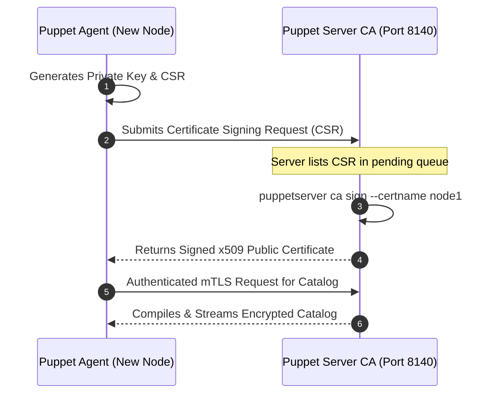

# Advanced Puppet & Enterprise CloudOps Architecture Guide

---

## 1. Technical Definition: Hiera (Hierarchical Data Lookup)

> **Formal Technical Definition:**
> **Hiera** is a built-in key-value configuration data lookup system for Puppet. It implements a hierarchical priority search model that separates *configuration data* (passwords, port numbers, package versions, environment flags) from *declarative manifest code*. Hiera dynamically resolves variables by traversing a user-defined hierarchy defined in `hiera.yaml`, evaluating system facts (`trusted.certname`, `facts.os.family`, `environment`) from most-specific to least-specific.

### 1.1 The Conceptual Analogy (For Intuition)

*   **The Corporate Policy Handbook**:
    *   *The Default Rule (common.yaml)*: "Every employee in the company gets standard laptop model X and 15 vacation days."
    *   *The Regional Rule (environment/eu-west-1.yaml)*: "If the employee works in the European branch, grant 25 vacation days instead."
    *   *The Executive Override (nodes/ceo-server.yaml)*: "If the node is the CEO server, allocate 128 GB RAM and dedicated firewall rules."
    *   *Result*: You never write separate code for every employee; you write one clean code template and let Hiera look up the appropriate values!

```
+---------------------------------------------------------------------------------------------------+
|                                  HIERA LOOKUP TRAVERSAL HIERARCHY                                 |
|                                                                                                   |
|  [ 1. Node Specific: data/nodes/web01.production.yaml ]    <=== 1st Priority (Most Specific)     |
|      db_port: 5433 (Override for single node)                                                     |
|                         |                                                                         |
|                         v (If not found, fall down to next layer)                                 |
|  [ 2. Environment Specific: data/environment/production.yaml ]                                    |
|      log_level: "warn"                                                                            |
|      db_host: "prod-db.internal.net"                                                              |
|                         |                                                                         |
|                         v (If not found, fall down to default)                                    |
|  [ 3. Global Common: data/common.yaml ]                    <=== Lowest Priority (Default Baseline)|
|      log_level: "info"                                                                            |
|      http_port: 80                                                                                |
|      ntp_servers: ["0.pool.ntp.org", "1.pool.ntp.org"]                                            |
+---------------------------------------------------------------------------------------------------+
```

---

## 2. Configuring Hiera: `hiera.yaml` & Lookup Functions

### 2.1 The Hierarchy Definition (`hiera.yaml`)

```yaml
---
version: 5
defaults:
  datadir: data
  data_hash: yaml_data

hierarchy:
  - name: "Per-Node Configuration"
    path: "nodes/%{trusted.certname}.yaml"

  - name: "Per-Environment Configuration"
    path: "environment/%{environment}.yaml"

  - name: "Per-OS Family Configuration"
    path: "os/%{facts.os.family}.yaml"

  - name: "Global Common Defaults"
    path: "common.yaml"
```

### 2.2 Using Data in Puppet DSL: Automatic Parameter Lookup vs `lookup()`

#### Method A: Automatic Parameter Lookup (Industry Best Practice)
Puppet automatically looks up Hiera keys that match `<class_name>::<parameter_name>`:

```yaml
# In data/environment/production.yaml:
apache::http_port: 8080
apache::server_admin: "cloudops@example.com"
```

```puppet
# In modules/apache/manifests/init.pp:
class apache (
  Integer $http_port    = 80,                       # Uses 8080 automatically from Hiera in prod!
  String  $server_admin = 'webmaster@localhost',
) {
  file { '/etc/httpd/conf/httpd.conf':
    content => epp('apache/httpd.conf.epp', { 'port' => $http_port }),
  }
}
```

#### Method B: Explicit `lookup()` Function
```puppet
$ntp_servers = lookup('ntp_servers', Array[String], 'first', ['time.google.com'])
```

---

## 3. The Roles and Profiles Architectural Pattern

> **Formal Technical Definition:**
> The **Roles and Profiles Pattern** is an enterprise software design pattern for Puppet that decouples *component configuration* from *machine identity*.
> *   **Component Modules**: Technology-specific modules (e.g. `puppetlabs-apache`, `puppetlabs-postgresql`).
> *   **Profiles**: Technology integration wrappers that configure and wire multiple component modules together for your organization's standards.
> *   **Roles**: Machine identity definitions composed *strictly* of one or more profiles. A node is assigned **exactly one role**.

```
+---------------------------------------------------------------------------------------------------+
|                                 ROLES & PROFILES ARCHITECTURE                                     |
|                                                                                                   |
|  [ Node: web01.production.company.com ]                                                           |
|             |                                                                                     |
|             v (Assigned Exactly ONE Role)                                                         |
|  [ Role: role::ecommerce_webserver ]                                                              |
|             |                                                                                     |
|             +-----------------------+-----------------------+                                     |
|             |                       |                       |                                     |
|             v                       v                       v                                     |
|  [ Profile: profile::base ]  [ Profile: profile::apache ]  [ Profile: profile::datadog ]          |
|    - Configures SSH           - Installs Apache             - Installs Monitoring Agent           |
|    - Configures NTP           - Writes SSL Vhosts           - Configures API keys                 |
|    - Adds DevOps Users        - Tunes MPM Workers           - Attaches Disk Metrics               |
|             |                       |                       |                                     |
|             v                       v                       v                                     |
|  [ Module: puppetlabs-ntp ]  [ Module: puppetlabs-apache ] [ Module: datadog_agent ]              |
+---------------------------------------------------------------------------------------------------+
```

### 3.1 The 3 Golden Rules of Roles and Profiles
1.  **Rule 1**: A node must be assigned **only one role** (e.g., `include role::app_server`).
2.  **Rule 2**: Roles **never** declare raw resources (`package`, `file`, `service`). Roles only `include` profiles!
3.  **Rule 3**: Profiles **never** manage other profiles directly; they encapsulate business logic and call component modules.

---

## 4. Complete Roles & Profiles Code Example

### 4.1 Base Profile (`modules/profile/manifests/base.pp`)
```puppet
class profile::base {
  # Enforce corporate baseline security on EVERY server
  class { 'ntp':
    servers => ['0.pool.ntp.org', '1.pool.ntp.org'],
  }

  file { '/etc/motd':
    ensure  => file,
    owner   => 'root',
    group   => 'root',
    mode    => '0644',
    content => "Unauthorized access to ${facts['networking']['fqdn']} is strictly prohibited!\n",
  }

  # Ensure root password login over SSH is disabled
  file_line { 'disable_root_ssh':
    path  => '/etc/ssh/sshd_config',
    line  => 'PermitRootLogin no',
    match => '^PermitRootLogin',
  }
}
```

### 4.2 Web Profile (`modules/profile/manifests/webserver.pp`)
```puppet
class profile::webserver (
  Integer $port        = lookup('profile::webserver::port', Integer, 'first', 80),
  String  $doc_root    = '/var/www/html',
  String  $server_name = $facts['networking']['fqdn'],
) {
  # Include baseline profile
  include profile::base

  # Configure Apache using the component module
  class { 'apache':
    default_vhost => false,
  }

  apache::vhost { $server_name:
    port    => $port,
    docroot => $doc_root,
  }

  file { "${doc_root}/index.html":
    ensure  => file,
    owner   => 'apache',
    group   => 'apache',
    mode    => '0644',
    content => epp('profile/index.html.epp', { 'hostname' => $facts['networking']['hostname'] }),
    require => Class['apache'],
  }
}
```

### 4.3 The Role (`modules/role/manifests/web_app_node.pp`)
```puppet
class role::web_app_node {
  include profile::base
  include profile::webserver
}
```

### 4.4 Node Classification (`manifests/site.pp`)
```puppet
node 'web01.production.company.com' {
  include role::web_app_node
}

# Regex matching for dynamic node classification:
node /^web\d+\.staging\.company\.com$/ {
  include role::web_app_node
}

# Fallback default node definition:
node default {
  include profile::base
}
```

---

## 5. Master-Agent PKI & SSL Certificate Management

> **Technical Definition:**
> Puppet Master-Agent communication uses **mutual Transport Layer Security (mTLS)** over TCP port **8140**. The Puppet Server acts as a dedicated **Certificate Authority (CA)**. The agent cannot receive a catalog until its client certificate is cryptographically signed by the CA.



### 5.1 CloudOps SSL Command Runbook

```bash
# 1. On the Puppet Server: List all pending certificate signing requests
sudo puppetserver ca list

# 2. On the Puppet Server: Sign a specific node's certificate
sudo puppetserver ca sign --certname web01.production.company.com

# 3. On the Puppet Server: Sign ALL pending certificates in bulk
sudo puppetserver ca sign --all

# 4. On the Puppet Server: Revoke a compromised or decommissioned server
sudo puppetserver ca revoke --certname web01.production.company.com
sudo puppetserver ca clean --certname web01.production.company.com

# 5. On the Puppet Agent: If the certificate is corrupted, regenerate it cleanly:
sudo rm -rf /etc/puppetlabs/puppet/ssl
sudo puppet agent -t
```

---

## 6. Enterprise Module Management: The `Puppetfile` & r10k

In modern CloudOps, modules are not committed directly to the Git repository. Instead, an environment **`Puppetfile`** declares upstream Forge modules and internal Git repos:

```ruby
# ==============================================================================
# Puppetfile (Used by r10k and Puppet Code Manager)
# ==============================================================================
forge 'https://forge.puppet.com'

# Standard Community Modules from Puppet Forge:
mod 'puppetlabs-stdlib', '9.4.0'
mod 'puppetlabs-apache', '12.0.0'
mod 'puppetlabs-postgresql', '10.0.0'
mod 'puppetlabs-ntp', '10.0.0'
mod 'puppetlabs-firewall', '8.0.0'

# Internal Private Company Modules from Git:
mod 'profile',
  :git    => 'git@github.com:mycompany/puppet-profile.git',
  :branch => 'production'

mod 'role',
  :git    => 'git@github.com:mycompany/puppet-role.git',
  :branch => 'production'
```

### 6.1 Deploying Environments via r10k
```bash
# Deploy all environments and pull modules declared in the Puppetfile
sudo r10k deploy environment -p -v
```

---

## 7. CloudOps Incident Response & Debugging Matrix

| Symptom / Error | Technical Root Cause | Remediation Procedure |
| :--- | :--- | :--- |
| **`SSL_connect returned=1 errno=0 state=error: certificate verify failed`** | Puppet Agent SSL certificate expired, or Master CA was re-created with a new fingerprint. | 1. Clean agent certificate on Master: `puppetserver ca clean --certname <node>`.<br>2. Delete agent local SSL dir: `rm -rf /etc/puppetlabs/puppet/ssl`.<br>3. Re-run `puppet agent -t` and re-sign. |
| **`Could not find class ::apache for node`** | Module is missing from `$modulepath` or `Puppetfile` failed to download it. | 1. Check `puppet config print modulepath`.<br>2. Re-run `r10k deploy environment -p` to re-fetch modules. |
| **`Duplicate declaration: Package[nginx] is already declared`** | Two separate classes attempt to manage the same `Package['nginx']` resource independently. | Refactor code to use **Profiles**: Manage `Package['nginx']` in a single shared profile, or use `ensure_packages(['nginx'])` from stdlib. |
| **`Evaluation Error: Error while evaluating a Function Call, Failed to parse template`** | Syntax error inside an EPP or ERB template file. | Validate template syntax before committing: `puppet epp validate template.epp`. |

---

## 8. Summary Checklist for Advanced Puppet CloudOps

- [x] **Separate Data from Code**: Store configuration parameters in **Hiera YAML** files, never hardcoded in `.pp` manifests.
- [x] **Adhere to Roles and Profiles**: Exactly **1 Role** per server; Roles only include Profiles; Profiles manage modules.
- [x] **Manage Upstream Dependencies via `Puppetfile`**: Pin explicit module versions using r10k.
- [x] **Validate Manifests Before Deployment**: Run `puppet-lint` and `puppet parser validate` in CI/CD pipelines.
